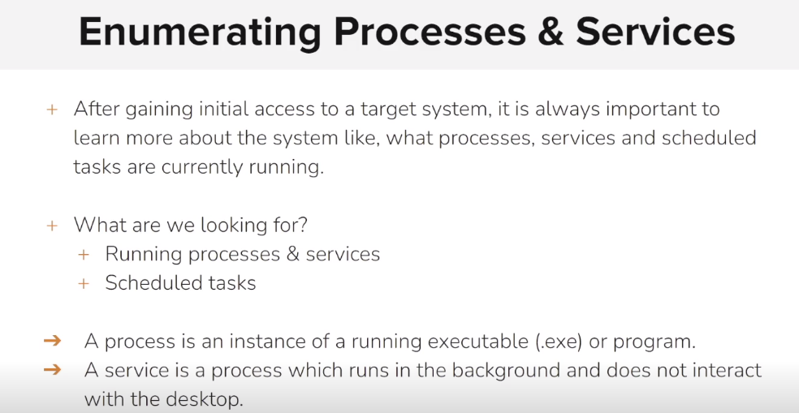

# Enumerating Processes and Services

<figure><figcaption></figcaption></figure>

```sh
meterpreter > ps

Process List
============

 PID   PPID  Name                  Arch  Session  User                           Path
 ---   ----  ----                  ----  -------  ----                           ----
 0     0     [System Process]                                                    
 4     0     System                x64   0                                       
 352   4     smss.exe              x64   0                                       
 496   488   csrss.exe             x64   0                                       
 560   552   csrss.exe             x64   1                                       
 568   488   wininit.exe           x64   0        NT AUTHORITY\SYSTEM            C:\Windows\System32\wininit.exe
 596   552   winlogon.exe          x64   1        NT AUTHORITY\SYSTEM            C:\Windows\System32\winlogon.exe
 660   568   services.exe          x64   0                                       
 668   568   lsass.exe             x64   0        NT AUTHORITY\SYSTEM            C:\Windows\System32\lsass.exe
 724   660   svchost.exe           x64   0        NT AUTHORITY\SYSTEM            C:\Windows\System32\svchost.exe
 736   660   svchost.exe           x64   0        NT AUTHORITY\NETWORK SERVICE   C:\Windows\System32\svchost.exe
 752   660   svchost.exe           x64   0        NT AUTHORITY\NETWORK SERVICE   C:\Windows\System32\svchost.exe
 800   660   svchost.exe           x64   0        NT AUTHORITY\LOCAL SERVICE     C:\Windows\System32\svchost.exe
 852   596   dwm.exe               x64   1        Window Manager\DWM-1           C:\Windows\System32\dwm.exe
 860   660   svchost.exe           x64   0        NT AUTHORITY\LOCAL SERVICE     C:\Windows\System32\svchost.exe
 896   660   svchost.exe           x64   0        NT AUTHORITY\SYSTEM            C:\Windows\System32\svchost.exe
 932   660   svchost.exe           x64   0        NT AUTHORITY\LOCAL SERVICE     C:\Windows\System32\svchost.exe
 968   724   WmiPrvSE.exe          x64   0        NT AUTHORITY\NETWORK SERVICE   C:\Windows\System32\wbem\WmiPrvSE.exe
 1012  660   svchost.exe           x64   0        NT AUTHORITY\NETWORK SERVICE   C:\Windows\System32\svchost.exe
 1032  660   spoolsv.exe           x64   0        NT AUTHORITY\SYSTEM            C:\Windows\System32\spoolsv.exe
 1068  660   amazon-ssm-agent.exe  x64   0        NT AUTHORITY\SYSTEM            C:\Program Files\Amazon\SSM\amazon-ssm-agent.exe
 1116  660   LiteAgent.exe         x64   0        NT AUTHORITY\SYSTEM            C:\Program Files\Amazon\XenTools\LiteAgent.exe
 1136  660   svchost.exe           x64   0        NT AUTHORITY\SYSTEM            C:\Windows\System32\svchost.exe
 1180  660   svchost.exe           x64   0        NT AUTHORITY\SYSTEM            C:\Windows\System32\svchost.exe
 1256  660   Ec2Config.exe         x64   0        NT AUTHORITY\SYSTEM            C:\Program Files\Amazon\Ec2ConfigService\Ec2Config.exe
 1536  3024  conhost.exe           x64   1        WIN-OMCNBKR66MN\Administrator  C:\Windows\System32\conhost.exe
 1916  2836  mNYTtKVyuEXWAGh.exe   x86   1        WIN-OMCNBKR66MN\Administrator  C:\Users\ADMINI~1\AppData\Local\Temp\1\rad08E11.tmp\mNYTtKVyuEXWAGh.exe
 1948  660   svchost.exe           x64   0        NT AUTHORITY\NETWORK SERVICE   C:\Windows\System32\svchost.exe
 2340  3052  hfs.exe               x86   1        WIN-OMCNBKR66MN\Administrator  C:\hfs\hfs.exe
 2416  896   taskhostex.exe        x64   1        WIN-OMCNBKR66MN\Administrator  C:\Windows\System32\taskhostex.exe
 2488  2456  explorer.exe          x64   1        WIN-OMCNBKR66MN\Administrator  C:\Windows\explorer.exe
 2836  2340  wscript.exe           x86   1        WIN-OMCNBKR66MN\Administrator  C:\Windows\SysWOW64\wscript.exe
 2912  660   msdtc.exe             x64   0        NT AUTHORITY\NETWORK SERVICE   C:\Windows\System32\msdtc.exe
 3024  1916  cmd.exe               x86   1        WIN-OMCNBKR66MN\Administrator  C:\Windows\SysWOW64\cmd.exe
 3052  2488  powershell.exe        x86   1        WIN-OMCNBKR66MN\Administrator  C:\Windows\SysWOW64\WindowsPowerShell\v1.0\powershell.exe
 3060  3052  conhost.exe           x64   1        WIN-OMCNBKR66MN\Administrator  C:\Windows\System32\conhost.exe


```

```sh
meterpreter > pgrep explorer.exe
2488
meterpreter > migrate 2488
[*] Migrating from 1916 to 2488...
[*] Migration completed successfully.
meterpreter > getuid
Server username: WIN-OMCNBKR66MN\Administrator
meterpreter > sysinfo
Computer        : WIN-OMCNBKR66MN
OS              : Windows 2012 R2 (6.3 Build 9600).
Architecture    : x64
System Language : en_US
Domain          : WORKGROUP
Logged On Users : 1
Meterpreter     : x64/windows

```

```sh
meterpreter > shell
Process 2616 created.
Channel 1 created.
Microsoft Windows [Version 6.3.9600]
(c) 2013 Microsoft Corporation. All rights reserved.

C:\Windows\system32>net start          
net start
These Windows services are started:

   Amazon SSM Agent
   AWS Lite Guest Agent
   Background Tasks Infrastructure Service
   Base Filtering Engine
   Certificate Propagation
   CNG Key Isolation
   COM+ Event System
   Cryptographic Services
   DCOM Server Process Launcher
   Device Setup Manager
   DHCP Client
   Diagnostic Policy Service
   Diagnostics Tracking Service
   Distributed Link Tracking Client
   Distributed Transaction Coordinator
   DNS Client
   Ec2Config
   Group Policy Client
   IKE and AuthIP IPsec Keying Modules
   IP Helper
   IPsec Policy Agent
   Local Session Manager
   Network List Service
   Network Location Awareness
   Network Store Interface Service
   Plug and Play
   Power
   Print Spooler
   Remote Desktop Configuration
   Remote Desktop Services
   Remote Desktop Services UserMode Port Redirector
   Remote Procedure Call (RPC)
   RPC Endpoint Mapper
   Security Accounts Manager
   Server
   Shell Hardware Detection
   System Event Notification Service
   System Events Broker
   Task Scheduler
   TCP/IP NetBIOS Helper
   Themes
   User Access Logging Service
   User Profile Service
   Windows Connection Manager
   Windows Event Log
   Windows Font Cache Service
   Windows Management Instrumentation
   Windows Remote Management (WS-Management)
   Workstation

The command completed successfully.
```

```sh
C:\Windows\system32>wmic service list brief
wmic service list brief
ExitCode  Name                      ProcessId  StartMode  State    Status  
0         AeLookupSvc               0          Manual     Stopped  OK      
1077      ALG                       0          Manual     Stopped  OK      
0         AmazonSSMAgent            1068       Auto       Running  OK      
1077      AppIDSvc                  0          Manual     Stopped  OK      
1077      Appinfo                   0          Manual     Stopped  OK      
1077      AppMgmt                   0          Manual     Stopped  OK      
1077      AppReadiness              0          Manual     Stopped  OK      
1077      AppXSvc                   0          Manual     Stopped  OK      
1077      AudioEndpointBuilder      0          Manual     Stopped  OK      
1077      Audiosrv                  0          Manual     Stopped  OK      
0         AWSLiteAgent              1116       Auto       Running  OK      
0         BFE                       800        Auto       Running  OK      
1077      BITS                      0          Manual     Stopped  OK      
0         BrokerInfrastructure      724        Auto       Running  OK      
1077      Browser                   0          Disabled   Stopped  OK      
0         CertPropSvc               896        Manual     Running  OK      
1077      cfn-hup                   0          Manual     Stopped  OK      
1077      COMSysApp                 0          Manual     Stopped  OK      
0         CryptSvc                  1012       Auto       Running  OK      
0         DcomLaunch                724        Auto       Running  OK      
0         defragsvc                 0          Manual     Stopped  OK      
1077      DeviceAssociationService  0          Manual     Stopped  OK      
0         DeviceInstall             0          Manual     Stopped  OK      
0         Dhcp                      860        Auto       Running  OK      
0         DiagTrack                 1136       Auto       Running  OK      
0         Dnscache                  1012       Auto       Running  OK      
1077      dot3svc                   0          Manual     Stopped  OK      
0         DPS                       800        Auto       Running  OK      
0         DsmSvc                    896        Manual     Running  OK      
1077      Eaphost                   0          Manual     Stopped  OK      
0         Ec2Config                 1256       Auto       Running  OK      
1077      EFS                       0          Manual     Stopped  OK      
0         EventLog                  860        Auto       Running  OK      
0         EventSystem               932        Auto       Running  OK      
1077      fdPHost                   0          Manual     Stopped  OK      
1077      FDResPub                  0          Manual     Stopped  OK      
0         FontCache                 932        Auto       Running  OK      
0         gpsvc                     896        Auto       Running  OK      
1077      hidserv                   0          Manual     Stopped  OK      
1077      hkmsvc                    0          Manual     Stopped  OK      
1077      IEEtwCollectorService     0          Manual     Stopped  OK      
0         IKEEXT                    896        Auto       Running  OK      
0         iphlpsvc                  896        Auto       Running  OK      
0         KeyIso                    668        Manual     Running  OK      
1077      KPSSVC                    0          Manual     Stopped  OK      
1077      KtmRm                     0          Manual     Stopped  OK      
0         LanmanServer              896        Auto       Running  OK      
0         LanmanWorkstation         1012       Auto       Running  OK      
1077      lltdsvc                   0          Manual     Stopped  OK      
0         lmhosts                   860        Auto       Running  OK      
0         LSM                       724        Auto       Running  OK      
1077      MMCSS                     0          Manual     Stopped  OK      
1077      MozillaMaintenance        0          Manual     Stopped  OK      
1077      MpsSvc                    0          Disabled   Stopped  OK      
0         MSDTC                     2912       Auto       Running  OK      
1077      MSiSCSI                   0          Manual     Stopped  OK      
1077      msiserver                 0          Manual     Stopped  OK      
1077      napagent                  0          Manual     Stopped  OK      
1077      NcaSvc                    0          Manual     Stopped  OK      
1077      Netlogon                  0          Manual     Stopped  OK      
1077      Netman                    0          Manual     Stopped  OK      
0         netprofm                  932        Manual     Running  OK      
1077      NetTcpPortSharing         0          Disabled   Stopped  OK      
0         NlaSvc                    1012       Auto       Running  OK      
0         nsi                       932        Auto       Running  OK      
1077      PerfHost                  0          Manual     Stopped  OK      
1077      pla                       0          Manual     Stopped  OK      
0         PlugPlay                  724        Manual     Running  OK      
0         PolicyAgent               736        Manual     Running  OK      
0         Power                     724        Auto       Running  OK      
1077      PrintNotify               0          Manual     Stopped  OK      
0         ProfSvc                   896        Auto       Running  OK      
1077      RasAuto                   0          Manual     Stopped  OK      
1077      RasMan                    0          Manual     Stopped  OK      
1077      RemoteAccess              0          Disabled   Stopped  OK      
0         RemoteRegistry            0          Auto       Stopped  OK      
0         RpcEptMapper              752        Auto       Running  OK      
1077      RpcLocator                0          Manual     Stopped  OK      
0         RpcSs                     752        Auto       Running  OK      
1077      RSoPProv                  0          Manual     Stopped  OK      
1077      sacsvr                    0          Manual     Stopped  OK      
0         SamSs                     668        Auto       Running  OK      
1077      SCardSvr                  0          Disabled   Stopped  OK      
1077      ScDeviceEnum              0          Manual     Stopped  OK      
0         Schedule                  896        Auto       Running  OK      
1077      SCPolicySvc               0          Manual     Stopped  OK      
1077      seclogon                  0          Manual     Stopped  OK      
0         SENS                      896        Auto       Running  OK      
0         SessionEnv                896        Manual     Running  OK      
1077      SharedAccess              0          Disabled   Stopped  OK      
0         ShellHWDetection          896        Auto       Running  OK      
1077      smphost                   0          Manual     Stopped  OK      
1077      SNMPTRAP                  0          Manual     Stopped  OK      
0         Spooler                   1032       Auto       Running  OK      
0         sppsvc                    0          Auto       Stopped  OK      
1077      SSDPSRV                   0          Disabled   Stopped  OK      
1077      SstpSvc                   0          Manual     Stopped  OK      
1077      svsvc                     0          Manual     Stopped  OK      
1077      swprv                     0          Manual     Stopped  OK      
1077      SysMain                   0          Manual     Stopped  OK      
0         SystemEventsBroker        724        Auto       Running  OK      
1077      TapiSrv                   0          Manual     Stopped  OK      
0         TermService               1948       Manual     Running  OK      
0         Themes                    896        Auto       Running  OK      
1077      THREADORDER               0          Manual     Stopped  OK      
1077      TieringEngineService      0          Manual     Stopped  OK      
0         TrkWks                    1180       Auto       Running  OK      
0         TrustedInstaller          0          Manual     Stopped  OK      
0         UALSVC                    1180       Auto       Running  OK      
1077      UI0Detect                 0          Manual     Stopped  OK      
0         UmRdpService              1180       Manual     Running  OK      
1077      upnphost                  0          Disabled   Stopped  OK      
1077      VaultSvc                  0          Manual     Stopped  OK      
0         vds                       0          Manual     Stopped  OK      
1077      vmicguestinterface        0          Manual     Stopped  OK      
1077      vmicheartbeat             0          Manual     Stopped  OK      
1077      vmickvpexchange           0          Manual     Stopped  OK      
1077      vmicrdv                   0          Manual     Stopped  OK      
1077      vmicshutdown              0          Manual     Stopped  OK      
1077      vmictimesync              0          Manual     Stopped  OK      
1077      vmicvss                   0          Manual     Stopped  OK      
1077      VSS                       0          Manual     Stopped  OK      
0         W32Time                   0          Manual     Stopped  OK      
0         Wcmsvc                    860        Auto       Running  OK      
1077      WcsPlugInService          0          Manual     Stopped  OK      
1077      WdiServiceHost            0          Manual     Stopped  OK      
1077      WdiSystemHost             0          Manual     Stopped  OK      
1077      Wecsvc                    0          Manual     Stopped  OK      
1077      WEPHOSTSVC                0          Manual     Stopped  OK      
1077      wercplsupport             0          Manual     Stopped  OK      
1077      WerSvc                    0          Disabled   Stopped  OK      
0         WinHttpAutoProxySvc       0          Manual     Stopped  OK      
0         Winmgmt                   896        Auto       Running  OK      
0         WinRM                     1012       Auto       Running  OK      
1077      wmiApSrv                  0          Manual     Stopped  OK      
0         WPDBusEnum                0          Manual     Stopped  OK      
1077      WSService                 0          Manual     Stopped  OK      
1077      wuauserv                  0          Manual     Stopped  OK      
1077      wudfsvc                   0          Manual     Stopped  OK      


```

```sh
C:\Windows\system32>tasklist /SVC
tasklist /SVC

Image Name                     PID Services                                    
========================= ======== ============================================
System Idle Process              0 N/A                                         
System                           4 N/A                                         
smss.exe                       352 N/A                                         
csrss.exe                      496 N/A                                         
csrss.exe                      560 N/A                                         
wininit.exe                    568 N/A                                         
winlogon.exe                   596 N/A                                         
services.exe                   660 N/A                                         
lsass.exe                      668 KeyIso, SamSs                               
svchost.exe                    724 BrokerInfrastructure, DcomLaunch, LSM,      
                                   PlugPlay, Power, SystemEventsBroker         
svchost.exe                    752 RpcEptMapper, RpcSs                         
dwm.exe                        852 N/A                                         
svchost.exe                    860 Dhcp, EventLog, lmhosts, Wcmsvc             
svchost.exe                    896 CertPropSvc, DsmSvc, gpsvc, IKEEXT,         
                                   iphlpsvc, LanmanServer, ProfSvc, Schedule,  
                                   SENS, SessionEnv, ShellHWDetection, Themes, 
                                   Winmgmt                                     
svchost.exe                    932 EventSystem, FontCache, netprofm, nsi       
svchost.exe                   1012 CryptSvc, Dnscache, LanmanWorkstation,      
                                   NlaSvc, WinRM                               
svchost.exe                    800 BFE, DPS                                    
spoolsv.exe                   1032 Spooler                                     
amazon-ssm-agent.exe          1068 AmazonSSMAgent                              
LiteAgent.exe                 1116 AWSLiteAgent                                
svchost.exe                   1136 DiagTrack                                   
svchost.exe                   1180 TrkWks, UALSVC, UmRdpService                
Ec2Config.exe                 1256 Ec2Config                                   
svchost.exe                   1948 TermService                                 
svchost.exe                    736 PolicyAgent                                 
taskhostex.exe                2416 N/A                                         
explorer.exe                  2488 N/A                                         
powershell.exe                3052 N/A                                         
conhost.exe                   3060 N/A                                         
hfs.exe                       2340 N/A                                         
msdtc.exe                     2912 MSDTC                                       
cmd.exe                       3024 N/A                                         
conhost.exe                   1536 N/A                                         
cmd.exe                       2616 N/A                                         
conhost.exe                   2240 N/A                                         
WmiPrvSE.exe                  2168 N/A                                         
tasklist.exe                  2800 N/A      
```

```sh
C:\Windows\system32>schtasks /query /fo LIST /v
```

